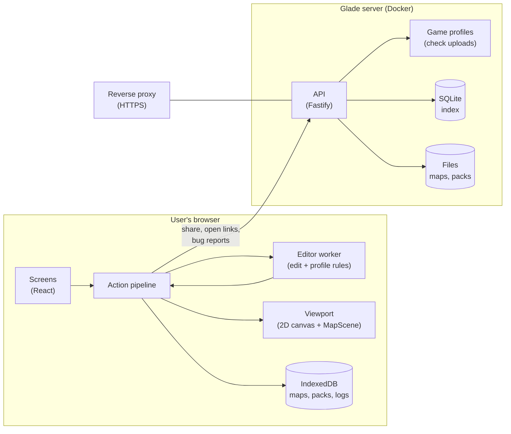
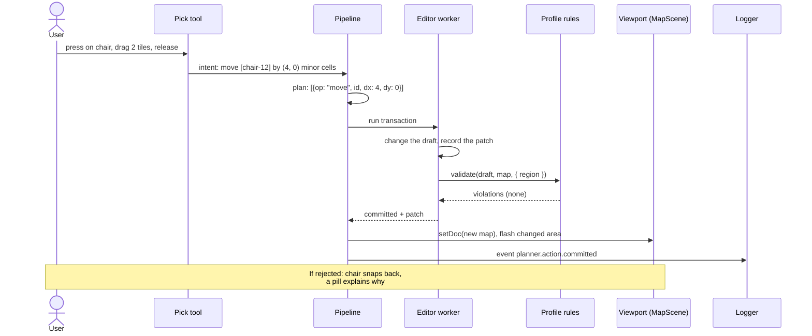

# Architecture

Glade is a web app for planning maps and building items for cosy building games. This page is the
overview: what Glade is, the idea that shapes it, its parts, and where code lives. Each component
has its own folder of docs with the details ([docs/README.md](README.md) lists them).

## Glade in one page

> **In short:** Glade has two tools per game: a **Planner** (design your island) and a **Builder**
> (make your own items). Each game is described by a **profile**: its maps, rules, item kinds and
> look. The rest of Glade is shared by every game: the screens, the tools, editing, saving and
> sharing. No accounts. It runs as one Docker container.

### What a user can do

1. Open `glade.app/petit-planet/planner`.
2. See their island in 2D or 3D, styled like the game.
3. Place houses, furniture, plants, bridges. Paint paths. Shape cliffs and water.
4. Get told, in plain words, when something breaks a game rule.
5. Build a custom item in the Builder, like a lounge chair or a hedge.
6. Save maps and items. Share them with a link. Open and edit maps other people shared.
7. Put small things on tables. After 1.0: decorate the inside of homes.

### The two apps

| App          | URL               | Job                                                                    |
| ------------ | ----------------- | ---------------------------------------------------------------------- |
| Planner      | `/<game>/planner` | Design a map.                                                          |
| Builder      | `/<game>/builder` | Make custom items. Can also open as a small window inside the planner. |
| Home (later) | `/`               | Pick a game. Not in the first version.                                 |

### Games

| Game                                | Profile                   | Planner               |
| ----------------------------------- | ------------------------- | --------------------- |
| Petit Planet: the island (`planet`) | 🟢 Ready                  | First game, first map |
| Petit Planet: homes (inside houses) | 🟢 Ready (2 room layouts) | After 1.0             |
| Palworld                            | Not yet                   | Later                 |
| Stardew Valley                      | Not yet                   | Later                 |

## The idea: consistency in differences

Every game looks like itself. Every game is used the same way.

- **Different:** each game has its own theme, fonts, icons, words, items and look. Petit Planet
  feels like Petit Planet.
- **The same:** the controls, where things sit on screen, the keys, and what happens when you
  drag, select or undo. Someone who knows one planner knows them all.

The same idea holds inside the code. **Glade has one engine; each game gives it settings.** Games
that work alike share the same tools and the same editing code, and differ only in the facts their
profile states.

**Example: dragging a T-shaped mountain.** Three block games, three support rules:

1. **The planner** (the same in every game) turns the drag into a request: "move these blocks 5 to
   the right". It never changes the map itself.
2. **The shared terrain editing** (`packages/edit`) lifts the blocks, puts them down, and asks the
   game's profile what to do with the parts left hanging in the air:
   - Petit Planet (`support: "full"`): fill every column down to the ground.
   - Timberborn (`support: { overhang: 2 }`): add pillars where an overhang is longer than 2.
   - Minecraft (`support: "none"`): leave it as it is.
3. **The profile's rules** check the result.

The drag (step 2) and the check (step 3) read the **same setting** from the profile, so an edit can
never make something the rules reject. A fact about a game is written once, in its profile.

Shared code is built for the games that exist. The terrain editing starts with the one support
style Petit Planet needs; the others are added when a game that needs them arrives.

## The parts

> **In short:** `apps/` holds what runs: the web app and the server. `packages/` holds what they
> are built from: shared packages that never name a game, and `packages/games/<id>/`, one folder
> per game.

| Part         | Package               | Holds                                                                                         |
| ------------ | --------------------- | --------------------------------------------------------------------------------------------- |
| **Shared**   | `@glade/core`         | Maps, grids, layers, kinds and catalogs, rule checks, map files. Never changes a map.         |
|              | `@glade/render`       | The look as data: colours, times of day, seasons, 2D drawing, 3D geometry, item models.       |
|              | `@glade/three`        | `MapScene`: draws a map in 3D with three.js. No UI.                                           |
|              | `@glade/edit`         | Changes maps: ops on a draft, patches, transactions, undo, and shared ops (objects, terrain). |
|              | `@glade/planner`      | The planner: the action pipeline, tools, selection, and its screens.                          |
|              | `@glade/builder`      | The item builder: smart parts, layout rules, compiling to a model, and its screens.           |
|              | `@glade/viewport`     | Shows a map: 2D canvas, `MapScene` host, cameras, input, highlights, picking.                 |
|              | `@glade/ui`           | Design tokens and controls: buttons, toggles, sliders, menus, dialogs, shared icons.          |
|              | `@glade/logging`      | The event registry, logger, redaction and the `.gladelog` format.                             |
|              | `@glade/errors`       | `Result`, the error shape and the error code registry.                                        |
|              | `@glade/formats`      | Map, pack and clipboard files and their migrations; API shapes for web and server.            |
|              | `@glade/testkit`      | The contract every game passes, and render goldens. Tests only.                               |
| **Per game** | `@glade/<id>-profile` | What the game is: maps, grids, rules, kinds, item fields, settings (like `support`), look.    |
|              | `@glade/<id>-catalog` | The base items (with their models), categories, and builder templates.                        |
|              | `@glade/<id>-edit`    | Edits only this game has (for example how bridges span gaps). Often small.                    |
|              | `@glade/<id>-ui`      | How the game looks in Glade: theme, fonts, icons, modes, layers, rule text, guide pages.      |
| **Apps**     | `@glade/web`          | The browser app: routes, the game registry, storage, the worker, the API client.              |
|              | `@glade/server`       | The API: shared maps and packs, upload checks, bug reports.                                   |

Today the shared profile packages (`core`, `render`, `three`, `testkit`) and Petit Planet's profile
exist. The other packages are made when their code arrives, in the order of the
[roadmap](roadmap.md).

### Where does it go?

| Ask yourself                                                         | Home                              |
| -------------------------------------------------------------------- | --------------------------------- |
| Is it a fact about the game (grids, kinds, what's allowed, support)? | `packages/games/<id>/profile`     |
| Is it an item, a category or a builder template?                     | `packages/games/<id>/catalog`     |
| Does it change a map, and could other games use it too?              | `packages/edit`                   |
| Does it change a map, and only this game has it?                     | `packages/games/<id>/edit`        |
| Is it about input, tools or the planner's screens?                   | `packages/planner`                |
| Is it how the game looks in Glade (theme, icons, words on screen)?   | `packages/games/<id>/ui`          |
| Is it a control every screen uses (a button, a slider)?              | `packages/ui`                     |
| Is it about saving, sharing or the server?                           | `apps/server`, `packages/formats` |

Something moves from a game into a shared package when a second game needs it.

## Big picture

> **In short:** Glade is a **browser app** plus a **small server**. The browser does almost
> everything: drawing, editing, checking rules, saving locally. The server only stores shared maps
> and packs, and takes bug reports. The game profiles run in both places.



| Part                   | Runs where                 | Job                                                                                     |
| ---------------------- | -------------------------- | --------------------------------------------------------------------------------------- |
| Screens                | Browser, main thread       | Panels, menus, toolbox, pills.                                                          |
| Action pipeline        | Browser, main thread       | Turns every user action into checked edits ([planner internals](planner/internals.md)). |
| Editor worker          | Browser, background thread | Holds the real map. Runs the ops and undo, and asks the profile's rules what is wrong.  |
| Viewport               | Browser, main thread + GPU | Draws the map: 2D with the map's `plan.draw`, 3D with `MapScene`. Adds highlights.      |
| IndexedDB              | Browser storage            | Autosaves maps, packs, settings, recent logs.                                           |
| API                    | Server                     | Stores shared maps and packs. Takes bug reports.                                        |
| Profiles on the server | Server                     | Check that every upload is a real, valid file.                                          |
| SQLite + files         | Server disk                | Index of shared things + their content.                                                 |

### Local-first

1. Every map lives in the browser first.
2. Every change is saved to IndexedDB at once (debounced by 1 second).
3. The server is only used when you **share**, **open a link**, or **send a bug report**.
4. If the server is down, everything except sharing still works.

### One action, start to end (example: move a chair)



### Tech stack

| Layer             | Choice                                       | Why                                                                                                     |
| ----------------- | -------------------------------------------- | ------------------------------------------------------------------------------------------------------- |
| Language          | TypeScript (strict)                          | One language everywhere.                                                                                |
| Packages          | pnpm workspace                               | One install, one lockfile. Packages are TypeScript source with no build step.                           |
| Build             | Vite                                         | Fast dev server and builds.                                                                             |
| UI                | React 19                                     | Biggest ecosystem, best Storybook support.                                                              |
| Accessible parts  | React Aria Components                        | Keyboard, focus and screen reader behaviour done right for menus, sliders, toolbars, tooltips, dialogs. |
| Interaction logic | XState v5 state machines                     | Every tool is a clear list of states. Nothing "falls through the cracks".                               |
| App state         | Zustand                                      | Small. Works outside React, so the pipeline can use it.                                                 |
| 3D                | three.js through `MapScene` (`@glade/three`) | Draws any map's render format, with no UI attached.                                                     |
| Search            | MiniSearch                                   | Small, fast, fuzzy item search.                                                                         |
| Server            | Node.js 22 + Fastify                         | Fast, typed, schema validation built in.                                                                |
| Database          | SQLite (better-sqlite3)                      | One file. No extra service. Easy backup.                                                                |
| Validation        | zod                                          | Shared between browser and server.                                                                      |
| Unit tests        | Vitest                                       | Fast, and runs the TypeScript source directly.                                                          |
| UI tests          | Storybook 9 + Vitest addon + a11y addon      | Every component tested in isolation.                                                                    |
| End-to-end        | Playwright                                   | Real browsers, desktop and phone sizes.                                                                 |
| Logs              | Own event registry, OpenTelemetry log fields | See [logging](logging/README.md).                                                                       |

## File structure

```text
glade/
├─ apps/
│  ├─ web/                        @glade/web: the browser app
│  │  ├─ index.html
│  │  └─ src/
│  │     ├─ main.tsx              starts the app
│  │     ├─ app/                  routes, providers, error boundaries
│  │     │  └─ games.ts           the game registry: the only file that lists games
│  │     ├─ library/              maps and packs dialog
│  │     ├─ settings/             settings window
│  │     ├─ guide/                guide pages
│  │     ├─ platform/             storage, API client, worker bridge, logging setup
│  │     └─ workers/
│  │        ├─ editor.worker.ts   the map, the ops and undo, the rules
│  │        └─ thumbs.worker.ts   item thumbnails
│  └─ server/                     @glade/server: the API
│     └─ src/
│        ├─ routes/               maps, packs, reports, health, metrics
│        ├─ domain/               share keys, versions, limits
│        ├─ storage/              SQLite, blob files, migrations
│        └─ checks/               upload checks (with the game profiles)
├─ packages/
│  ├─ core/  render/  three/      the shared profile packages
│  ├─ edit/                       editing: draft, patch, transaction, history
│  │  └─ src/
│  │     ├─ objects/              place, move, rotate, copy, delete
│  │     └─ terrain/              raise, lower, sculpt, drag, and the support styles
│  ├─ planner/                    pipeline, tools, selection, input, store, screens
│  ├─ builder/                    smart parts engine and builder screens
│  ├─ viewport/                   2D host, MapScene host, cameras, overlays, picking
│  ├─ ui/                         design tokens, controls, shared icons
│  ├─ logging/  errors/  formats/
│  ├─ testkit/                    contract tests, render goldens
│  └─ games/
│     ├─ _fixture/profile/        a small made-up game for the contract tests
│     └─ petit-planet/
│        ├─ profile/              @glade/petit-planet-profile
│        ├─ catalog/              @glade/petit-planet-catalog
│        ├─ edit/                 @glade/petit-planet-edit
│        ├─ ui/                   @glade/petit-planet-ui
│        └─ references/           reference screenshots: local only, ignored by git
├─ tests/                         repo guards: import boundaries, references stay local
├─ e2e/                           Playwright tests
├─ docker/                        Dockerfile, compose.yml
├─ docs/
└─ .github/workflows/
```

Inside a game, the profile keeps one folder per map (`src/maps/<map>/`), and so do its `edit` and
`ui` packages when they hold something per map.

### Workspace

```yaml
# pnpm-workspace.yaml
packages:
  - "apps/*"
  - "packages/*"
  - "packages/games/*/*"
```

Code imports a package by its name: `import { bind, validate } from "@glade/core"`. Packages are
TypeScript source with no build step, so Vite (web) and esbuild (server) compile them with the
app.

### Import rules

Imports go one way: apps use packages; per-game packages use shared packages; nothing imports an
app. ESLint and `tests/boundaries.test.ts` check these.

| Code in                          | May import                                                         | Must never import                                              |
| -------------------------------- | ------------------------------------------------------------------ | -------------------------------------------------------------- |
| Shared packages (`packages/*`)   | Other shared packages                                              | Any game, any app                                              |
| A game's `profile`               | `core`, `render`                                                   | Its game's `catalog`, `edit` or `ui`; any app                  |
| A game's `catalog`               | Its `profile`, `core`, `render`                                    | Its `edit` or `ui`; other games; any app                       |
| A game's `edit`                  | Its `profile`, `core`, `edit`                                      | Its `ui`; other games; any app                                 |
| A game's `ui`                    | Its `profile`, `ui` (tokens and icons)                             | React; other games; any app                                    |
| `apps/web` (except the registry) | Shared packages                                                    | Games (they arrive through the registry)                       |
| `apps/web/src/app/games.ts`      | Every game's packages                                              | —                                                              |
| `apps/server`                    | `core`, `formats`, `logging`, `errors`, game profiles and catalogs | `three`, `viewport`, `planner`, `builder`, any game's `ui`     |
| Anything                         | A package by **name** (its public API)                             | A file inside another package by path; `samples` outside tests |

Shared packages are also checked for game words: a test fails if shared code says "cliff" or
"furniture". A game's profile ships no items, and its `samples/` (made-up items and maps) are for
tests only.

The profile packages hold no app code, so a profile can be used on its own by any tool that needs
to read a game's maps, rules or look.

## What each game gives Glade

> **In short:** The planner and the builder are game-free. Each game gives them its **profile**,
> its **catalog**, its **edits** and its **UI**. Adding a game means writing those four packages,
> not changing shared code.

The registry joins them up:

```ts
// apps/web/src/app/games.ts (simplified)
import { petitPlanet } from "@glade/petit-planet-profile";
import { catalog } from "@glade/petit-planet-catalog";
import { edits } from "@glade/petit-planet-edit";
import { ui } from "@glade/petit-planet-ui";

export const games: GladeGame[] = [{ profile: petitPlanet, catalog, edits, ui }];
```

Each shared package defines the part it reads:

```ts
// packages/planner: what the planner needs from a game's ui (simplified)
export interface GameUi {
  title: string; // "Petit Planet"
  theme: GameTheme; // colours, fonts, icon set
  guide: GuidePage[];
  /** The UI for one map of the profile. Every home layout shares one. */
  map(mapId: string): MapUi | undefined;
  /** Maps a user can start a new map from, in menu order. */
  newMapChoices: { mapId: string; label: string }[];
}

export interface MapUi {
  modes: ViewportMode[]; // island: Furniture, Paths, Cliffs, Water
  layers: LayerDef[]; // island: Houses, Furniture, Plants, Paths, Grid, Area
  environment: EnvironmentDef; // time key points, season toggle (a home's look is fixed)
  ruleText: RuleTextTable; // friendly violation text
  describe: TextViews; // screen reader text
}

export interface ViewportMode {
  id: string; // "cliffs"
  label: string; // "Cliffs"
  icon: IconId;
  grid: string; // the profile's grid shown and snapped to: "terrain"
  drawer: "catalog" | "palette" | "tools-only";
  tools: ToolId[]; // toolbox tools in this mode
  select: SelectionRules; // what each select tool picks here
  dimOthers?: string[]; // layers drawn see-through in this mode
}
```

```ts
// packages/edit: what editing needs from a game's edit package (simplified)
export interface GameEdits {
  /** The ops for one map: the shared ones it uses, and its own. */
  ops(mapId: string): OpTable;
  /** Turns an intent in a mode into ops (move a selection, paint a path). */
  plan(mapId: string, mode: string): ModePlanner;
}
```

A game's `ui` is data and plain functions, never React components. The planner draws every game
with the same components, which is what keeps the controls the same everywhere.

Petit Planet's parts, per map, are in [profiles/petit-planet.md](profiles/petit-planet.md).

### Game contract tests

Every game passes the contract tests in `packages/testkit`, for every map it has:

1. Every map passes the profile contract (grids, layers, rules, views, files). This part exists
   today.
2. Every mode's grid exists in the map's space.
3. Every rule in the map's rulebook (`map.rulebook()`) has friendly text.
4. The base catalog passes `catalogProblems(map, catalog)` for every map.
5. Every tool id is known to the planner.
6. Every layer maps to real layer toggles (`map.ui.layerNames()`).
7. Each mode's planner turns a sample intent into ops that commit on a fresh map (`map.newDoc`).
8. Each op's patch, undone, gives back the map it started from.
9. Theme colours pass contrast checks (4.5 : 1 for text).
10. Every map in the profile either has a UI or is listed as "not supported yet".

The `_fixture` game, with a 2D-only map, passes too. This proves the shared code works with any
game and any set of views.

## Words we use

| Word                      | Meaning                                                                                                                                                                                                                                          |
| ------------------------- | ------------------------------------------------------------------------------------------------------------------------------------------------------------------------------------------------------------------------------------------------ |
| **Game**                  | A game Glade supports, like Petit Planet.                                                                                                                                                                                                        |
| **Profile**               | What a game is: its maps, grids, rules, item kinds, settings and look (`@glade/<id>-profile`). In code, a `GameProfile`.                                                                                                                         |
| **Map type**              | One kind of world in a game. In code, a `MapDefinition`. Petit Planet has the island (`planet`) and homes (`interior_home_1_8`, `interior_home_1_10`). The UI never says "map type"; it says "Island" or "Home".                                 |
| **Map**                   | One design you make and save: an island or a home. In code, a `Doc`.                                                                                                                                                                             |
| **Layer**                 | One part of a map's data, like `terrain`, `paths`, `items`.                                                                                                                                                                                      |
| **Grid**                  | A set of cells over the map. The island has `major` (tiles), `minor` (half tiles), `terrain` (blocks), `area` (16 × 16 tiles).                                                                                                                   |
| **Rule**                  | A game rule, like "land can only step 3 levels". Rules only check; they never change a map.                                                                                                                                                      |
| **Violation**             | A broken rule, with the cells involved.                                                                                                                                                                                                          |
| **Op**                    | One edit, like `placeItem` or `raise`.                                                                                                                                                                                                           |
| **Transaction**           | A group of ops that all succeed or all fail.                                                                                                                                                                                                     |
| **Patch**                 | The exact before and after of every changed cell. Used for undo.                                                                                                                                                                                 |
| **Support style**         | A profile setting that says how terrain may hang over empty space: `full`, `none`, or a limited overhang.                                                                                                                                        |
| **Catalog**               | The list of things you can place.                                                                                                                                                                                                                |
| **Bind**                  | Joining a catalog to a map type: `bind(planet, catalog)`. Rules and drawing work on the result.                                                                                                                                                  |
| **Item**                  | One catalog entry: a chair, a tree, a path type.                                                                                                                                                                                                 |
| **Kind**                  | The type of an item, defined by the profile. Kinds can have a parent: `tree` is a sort of `plant`. Island kinds: `plant`, `tree`, `shrub`, `flower`, `item`, `building`, `bridge`, `incline`, `path`. Home kinds add `wallpaper` and `flooring`. |
| **Surface**               | The top of a table, stall or counter. Small **placeable** things stand on it.                                                                                                                                                                    |
| **Mount**                 | Where a home item goes: floor, wall or ceiling.                                                                                                                                                                                                  |
| **MapScene**              | The 3D drawing of one map (`@glade/three`). The viewport puts it on screen.                                                                                                                                                                      |
| **Pack**                  | A shareable bundle of custom items made in the builder.                                                                                                                                                                                          |
| **Base catalog**          | The items Glade ships for a game (not custom).                                                                                                                                                                                                   |
| **Viewport**              | The big area that shows the map.                                                                                                                                                                                                                 |
| **Viewport mode**         | What you are working on: Furniture, Paths, Cliffs or Water.                                                                                                                                                                                      |
| **Shell**                 | The planner's shared frame: side panel, rail, viewport chrome, toolbox frame. The same in every game.                                                                                                                                            |
| **Scope**                 | What tools can touch in the current viewport mode.                                                                                                                                                                                               |
| **Cursor control**        | Hand (camera) or Pick (choose and move things).                                                                                                                                                                                                  |
| **Select tool**           | Lasso, Rectangle, Circle or Magic.                                                                                                                                                                                                               |
| **Select mode**           | Set (replace), Add, or Subtract.                                                                                                                                                                                                                 |
| **Pill**                  | A small message that slides in from the top. Used for violations.                                                                                                                                                                                |
| **Actions menu**          | The small menu next to a selection (the "more" menu).                                                                                                                                                                                            |
| **Toolbox**               | The drawer under the viewport (or the bottom sheet on phones).                                                                                                                                                                                   |
| **Rail**                  | The thin, collapsed version of the side panel.                                                                                                                                                                                                   |
| **Template**              | A starting shape and rule set in the builder, like "Fence".                                                                                                                                                                                      |
| **Part**                  | One piece of a built item, like a slab or a leg.                                                                                                                                                                                                 |
| **Recipe**                | The builder's own editable description of an item. It compiles into a model.                                                                                                                                                                     |
| **Intent**                | What the user meant, like "move these 3 chairs 2 tiles left".                                                                                                                                                                                    |
| **Pipeline**              | The fixed steps every action goes through ([planner internals](planner/internals.md)).                                                                                                                                                           |
| **Worker**                | A background thread in the browser. Editing and rule checks run there so the screen never freezes.                                                                                                                                               |
| **Edit link / View link** | Share links. Edit links let others change the map. View links only show it.                                                                                                                                                                      |
