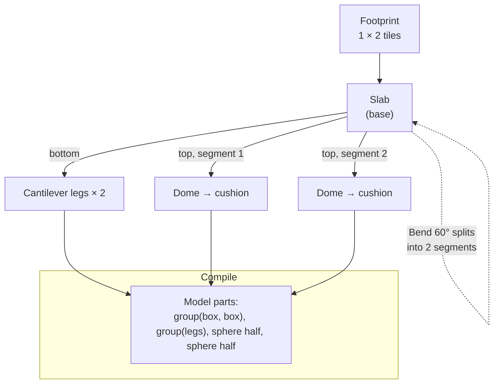

# The item builder

> **In short:** The builder makes custom items from **smart parts**: slabs, legs, toppings, plants and shapes. Parts snap to each other and adjust when you change things, using fixed rules (no AI). A **template** sets the item type and its rules. The result is a normal model, saved in a **pack**.

## Where it opens

| Way in                                              | What happens                                                              |
| --------------------------------------------------- | ------------------------------------------------------------------------- |
| `/<game>/builder`                                   | Full page builder. Title bar has a game picker and (later) a Home button. |
| **+ New item** in the planner toolbox               | Builder window opens empty, over the planner.                             |
| **Create new** on an item (drawer card or map item) | Builder window opens with a copy of that item.                            |
| Phones                                              | Builder always opens full screen.                                         |

## Layout

| Part               | Detail                                                                                                                                                                           |
| ------------------ | -------------------------------------------------------------------------------------------------------------------------------------------------------------------------------- |
| Title bar          | Item name and "not saved" state. Minimise, maximise, close. Standalone: game picker and Home instead of window buttons.                                                          |
| Templates          | Scrollable list on the left. Picking one sets the kind, footprint limits and special rules.                                                                                      |
| File, Undo, Redo   | Top left of the 3D view.                                                                                                                                                         |
| 3D view            | Rotate with drag, zoom with wheel or pinch. A footprint grid sits under the item. Drag on empty space draws a selection box.                                                     |
| Connection preview | Only for fence-like templates. Shows 3D previews of the item linked across, down and diagonally.                                                                                 |
| Add panel          | Top right. Search, or scroll by category: Bases, Legs, Toppings, Greenery, Decoration, Simple shapes. Click to add, or drag onto a surface. Slides in when the footprint is set. |
| Edit tools         | Bottom left. Slides in when a part is selected. General tools + the part's special tools.                                                                                        |
| Problems           | Live check result and part count ("14 of 256 parts"). Click a problem to select its part.                                                                                        |

## The builder window (inside the planner)

| Action         | Result                                                                    |
| -------------- | ------------------------------------------------------------------------- |
| Opens          | Small window (420 × 540) at the bottom right of the viewport.             |
| Drag title bar | Moves the window.                                                         |
| Drag corner    | Resizes it.                                                               |
| Minimise       | Becomes a small chip at the bottom right. Click to restore.               |
| Maximise       | Fills the viewport area. Click again to restore.                          |
| Close          | If not saved: "Save changes to Lounge chair?" Save / Don't save / Cancel. |
| Keyboard       | `F6` moves focus between the planner and the builder.                     |

## Templates (Petit Planet)

Kinds have parents, so a template picks a **kind**, not a flag. (Old entries with `building: true` or `tree: true` load through the profile's `upgradeCatalog`.) Templates live in the game's catalog package (`@glade/petit-planet-catalog`).

| Template                         | Kind + fields                               | Footprint limits                                       | Special rules / tools                                                                                                                                |
| -------------------------------- | ------------------------------------------- | ------------------------------------------------------ | ---------------------------------------------------------------------------------------------------------------------------------------------------- |
| Other                            | `item`                                      | 0.5 × 0.5 to 4 × 4 tiles                               | None                                                                                                                                                 |
| Fence / hedge                    | `item` + `connects`                         | Always 1 × 1 tile. The body can be 0.5 to 1 tile wide. | Connection preview. The map formula makes plain wide boxes into rails and other parts into posts.                                                    |
| House                            | `building` (a sort of `item`)               | 2 × 2 to 6 × 6 tiles                                   | Door added on the front by the game's item formula. Front row must stay clear (rule B1).                                                             |
| Tree                             | `tree` (a sort of `plant`)                  | Whole tiles                                            | Tree spacing rule (L6) shown as a ring in the planner.                                                                                               |
| Shrub / flower / plant           | `shrub`, `flower` or `plant`                | Whole tiles                                            | —                                                                                                                                                    |
| Bridge                           | `bridge` + `majorSize`                      | 1 or 2 wide, 4 to 7 long                               | Footprint must match `majorSize`.                                                                                                                    |
| Incline                          | `incline`                                   | 1 × 2 or 2 × 2                                         | Climbs one level.                                                                                                                                    |
| Path tile                        | `path` + `color`, `pattern`, `allowsPlants` | —                                                      | No model. Pick a colour, a pattern (cobble / plain), "plants allowed".                                                                               |
| Lamp / light                     | `item`                                      | 0.5 × 0.5 to 1 × 1                                     | Glow finish shown at night in the preview.                                                                                                           |
| Boat                             | `item` + `onWater`                          | 1 × 1 to 2 × 3                                         | Can sit on water.                                                                                                                                    |
| **Table / counter**              | `item` + `surface`                          | 1 × 1 to 4 × 2                                         | Draw the top's grid on the model's top face. Size of the top in half cells (a 2 × 2 table's top might be 12 × 12). Shows a cup on it in the preview. |
| **Small thing**                  | `item` + `placeable`                        | 0.5 × 0.5 to 1 × 1                                     | Also set its size on a table top. Preview shows it on a sample table. Can't also have a surface (nothing stacks).                                    |
| **Wall item** (homes)            | `item` + `mount: "wall"`                    | Half cells across and up the wall                      | Faces south with its back on the wall. Preview shows it on a wall.                                                                                   |
| **Ceiling item** (homes)         | `item` + `mount: "ceiling"`                 | Like floor items                                       | Preview shows it from below.                                                                                                                         |
| **Wallpaper / flooring** (homes) | `wallpaper` or `flooring` + `pattern`       | —                                                      | No model. A 2D sheet: colour + shapes (rects and circles). Pictures later (Q-23).                                                                    |

## Smart parts

Every part has **parameters**, **surfaces** you can attach things to, and **edit tools**.

| Category      | Parts                                           | Key parameters                           | Special tools                                           |
| ------------- | ----------------------------------------------- | ---------------------------------------- | ------------------------------------------------------- |
| Bases         | Slab (rectangle), disc, ring, pot               | Width, depth, thickness, corner rounding | **Bend 90°**, **Bend 60°** (slabs)                      |
| Legs          | Cantilever, pillar, tapered, sled, block        | Count, height, thickness, inset          | **Fewer / more legs**, rotate to the next pair of edges |
| Toppings      | Dome, cushion, tent, roof, shrub top            | Height, softness, form                   | **Change form** (anything that fits a dome shape)       |
| Greenery      | Leaf ball, grass tuft, vine, flowers            | Size, density, colour                    | Scatter count                                           |
| Decoration    | Knob, trim, lantern, sign                       | Size                                     | —                                                       |
| Simple shapes | Box, wedge, cylinder, cone, sphere, torus, tube | The model format's shape fields          | Free move, rotate, scale                                |

**General tools for every part:** Move (on its surface), Rotate (snaps every 15°), Scale, Paint, Duplicate, Delete.

**Paint:** solid colours from the game's palette, or any colour. Finish: matte, glow or glass. (Patterns later, see T-5.)

## How "smart without AI" works

1. **Surfaces.** Each part says which faces can hold other parts: `top`, `bottom`, `sides`, `edges`.
2. **Attach.** A new part attaches to one surface of a parent. This makes a tree of parts.
3. **Layout rules.** Each part type has one function: given its parent's surface, work out where I go and how big I am.
   - Legs on a rectangle: one per edge pair, spread evenly, inset from the corners.
   - Legs on a circle: spaced evenly around the edge.
   - Toppings: fill the free area of the surface, with a small margin.
4. **Rebuild in order.** After any change, Glade rebuilds top-down: footprint → bases → things on bases → things on those. Always the same order (a waterfall), so results are always the same.
5. **Compile.** The tree becomes plain model parts (boxes, wedges, cylinders, cones, spheres, rings, tubes, meshes, groups). Groups can **mirror** and **repeat** parts (in rows, rings and spirals), so "4 legs" compiles to one leg in a mirrored group, and "5 slats" to one slat with `repeat`. This keeps models small (limit: 256 solids).
6. **Check.** The profile's `entryProblems(planet, entry)` checks the whole entry: its fields, its model against its footprint, and the game's limits. Problems name the part (like `part 2 > 1 (box "leg")`), so Glade shows each one next to its part. `modelSchema` checks the shape of loaded data.
7. **Draw.** The 3D view uses `modelMesh(model, { blockSize })` from `@glade/render`. Each vertex knows which part it belongs to, so a click picks a part. [Item models](../profiles/models.md#building-an-item-builder) describes how a builder works with the format: edit with `partAt`, `replacePart`, `insertPart` (they never change the old model, so undo is easy).

**Recipe vs model:** a model stores only the finished parts, so the builder keeps its own settings. Each saved item has:

- `entry`: the catalog entry with the compiled `model` (what the planner uses),
- `recipe`: the builder's part tree and parameters (what the builder edits).

## Worked example: wooden lounge chair

1. Click the **Other** template.
2. Drag a box over the small grid in the 3D view: **1 × 2 tiles**. The Add panel slides in.
3. **Bases → Rectangular wooden slab.** Click it (or drag it in). It fills the footprint, with a small margin. It is selected, so the edit tools slide in.
4. **Paint → brown.**
5. **Bend 60°.** Draw a line across the top end of the slab (the line snaps across or along the slab, never diagonal).
   - The top part now tilts up at 60°. It is still joined, but is now its own segment.
   - Select it and stretch its length in its new direction.
6. Turn the camera to see the underside.
7. **Legs → Cantilever** (default 2). Drop them on the bottom. They snap to two opposite edges.
   - **Rotate** moves them to the other pair of edges.
   - **More legs** adds one on a free edge. Past 4, two legs share an edge (up to the part's max).
   - Leave at 2. Lower the height. **Paint → red.** The slab now rests on the legs, and the legs on the footprint.
8. **Toppings → Dome.** Drag it onto the flat top. It fills the free space.
9. Drag another dome onto the tilted segment. It fits that surface too.
10. Select a dome. **Change form → Cushion.** Do the same for the other.
11. **File → Save.** Name: "Lounge chair". Pack: "My furniture". Category: Seating.
12. It appears in the planner's toolbox under **Seating**.

## Worked example: square hedge

1. Click **Fence / hedge**. The footprint is fixed at 1 × 1 tile. The body width slider allows 0.5 to 1 tile.
2. **Bases → Rectangular slab.** Make it taller, like a square pot. **Paint → brown.**
3. **Toppings → Dome** (or a cut sphere). It snaps on top.
4. **Change form → Shrubbery.** It is now a hedge.
5. Click the **connection preview** button (top right). See it linked across, down and diagonally, using the game's fence rules.

## Curved surfaces (later)

Snapping a square topping to a sphere makes it bend along the face. This needs Glade to build its own triangles and save them as a `mesh` part. It is planned for Phase 9.

## File menu and save dialog

| File menu    | Does                                                                          |
| ------------ | ----------------------------------------------------------------------------- |
| New          | Empty builder (asks to save first if needed).                                 |
| Open…        | Pick an item from your packs or the base catalog (base items open as a copy). |
| Save         | Saves into its pack.                                                          |
| Save as…     | Saves a copy (new name, maybe another pack).                                  |
| Export item… | Downloads a single-item file.                                                 |

| Save dialog field | Required             | Example                                                                                       |
| ----------------- | -------------------- | --------------------------------------------------------------------------------------------- |
| Name              | Yes                  | Lounge chair                                                                                  |
| Pack              | Yes (pick or create) | My furniture                                                                                  |
| Category          | Yes                  | Seating                                                                                       |
| Tags              | No                   | wood, outdoor                                                                                 |
| Description       | No                   | A low wooden chair with cushions                                                              |
| Kind and fields   | From the template    | Kind: `building`, `tree`, `item`. Fields: on water, plants allowed, surface, placeable, mount |

## Builder keys

| Key                     | Action                                                     |
| ----------------------- | ---------------------------------------------------------- |
| `Ctrl + Z` / `Ctrl + Y` | Undo / redo (builder's own history)                        |
| `Ctrl + S`              | Save                                                       |
| `Delete`                | Delete part                                                |
| `Ctrl + D`              | Duplicate part                                             |
| `.` / `,`               | Select next / previous part (`Tab` stays for moving focus) |
| `Q` / `E`               | Turn the view                                              |
| `F`                     | Fit the item                                               |
| `G` / `R` / `S`         | Move / rotate / scale tool (like Blender)                  |
| `/`                     | Search the Add panel                                       |
