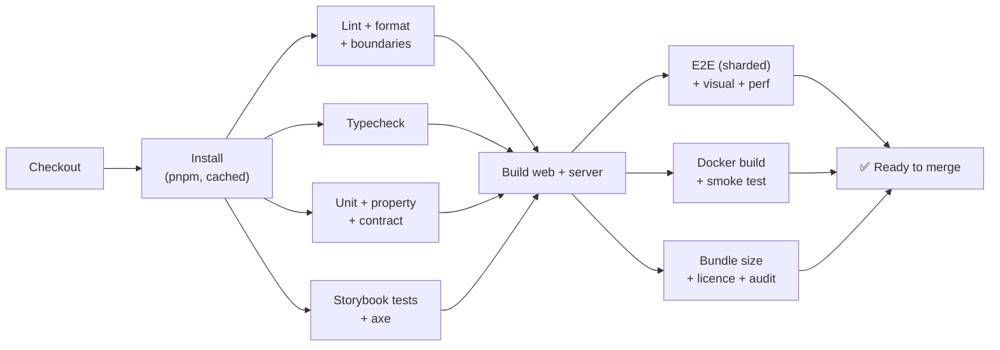
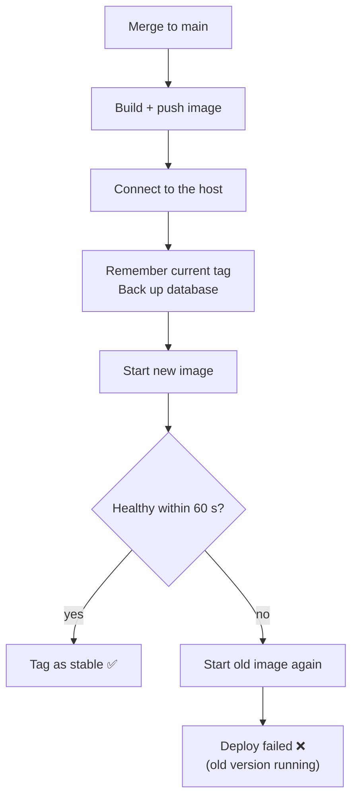

# CI, Docker, deploy and rollback

> **In short:** Every pull request runs all checks and builds the Docker image. Merging to `main` publishes the image to GitHub's registry. A deploy job updates the host, waits for a health check, and **rolls back by itself** if the check fails. Rolling back by hand is one button.

## CI on every pull request

Today CI runs lint, typecheck and the tests (`.github/workflows/ci.yml`). The other jobs below are
added as the apps they check arrive.



| Job                        | Fails the PR when                                                              |
| -------------------------- | ------------------------------------------------------------------------------ |
| Lint                       | ESLint, Prettier or the boundaries test fails                                  |
| Typecheck                  | `tsc` finds an error                                                           |
| Unit / property / contract | Any test fails, or coverage drops under target                                 |
| Storybook                  | A play test or an axe check fails                                              |
| E2E                        | A journey fails in any browser                                                 |
| Visual                     | Screenshots differ (a person must approve new ones)                            |
| Perf                       | A budget is broken (warning on PR, failure on `main`)                          |
| Docker                     | The image doesn't build, or `/health` doesn't answer in 30 s                   |
| Bundle / audit             | First load JS > 400 KB gzip, a high-severity advisory, or a disallowed licence |

## Branches and versions

- `main` is protected: pull request + green CI + one review (or self-review checklist).
- Commit messages follow **Conventional Commits** (`feat:`, `fix:`, `docs:`…).
- Versions follow **SemVer**. **Changesets** writes the changelog.
- Every image gets two tags: `sha-<short commit>` and, on release, `vX.Y.Z`. The deployed one also gets `stable`.

## The Docker image

```dockerfile
# docker/Dockerfile (sketch)
FROM node:22-bookworm-slim AS build
WORKDIR /src
RUN corepack enable
COPY . .
RUN pnpm install --frozen-lockfile \
 && pnpm --filter @glade/web build \
 && pnpm --filter @glade/server build        # bundles the server and the packages' TS source with esbuild

FROM node:22-bookworm-slim
RUN useradd --system --uid 10001 glade
WORKDIR /app
COPY --from=build /src/apps/server/dist ./
COPY --from=build /src/apps/web/dist ./public
USER glade
ENV NODE_ENV=production PORT=8080 DATA_DIR=/data
EXPOSE 8080
HEALTHCHECK --interval=30s --timeout=3s CMD node healthcheck.js
CMD ["node", "main.js"]
```

**Notes:** Debian slim (not Alpine) because SQLite's native module builds easily there. Packages are TypeScript with no build step, so the server build bundles them.

```yaml
# docker/compose.yml (example)
services:
  glade:
    image: ghcr.io/umushiumushi/glade:${GLADE_TAG:-stable}
    restart: unless-stopped
    read_only: true
    tmpfs: [/tmp]
    volumes:
      - ./data:/data
    mem_limit: 512m
    ports:
      - "127.0.0.1:8080:8080" # behind a reverse proxy that serves HTTPS
```

Any reverse proxy works (Caddy, nginx, Traefik). It adds HTTPS and HSTS. Automatic image
updaters should leave Glade alone: deploys are health-gated instead.

## Deploy (automatic, after merge to `main`)

1. CI builds and pushes `ghcr.io/…/glade:sha-abc123`.
2. The deploy job connects to the host over a private network (short-lived credentials).
3. It logs in as a `deploy` user that may run only one script: `glade-deploy <tag>`.
4. The script:
   1. Writes down the current tag (for rollback).
   2. Backs up the database (`sqlite3 .backup`).
   3. Pulls the new image.
   4. Runs `docker compose up -d` with the new tag.
   5. Calls `/api/v1/health` every 2 s for up to 60 s.
   6. ✅ Healthy: tags it `stable`, done.
   7. ❌ Not healthy: starts the old tag again, checks health, and marks the job failed.
5. GitHub shows the result.



## Rollback by hand

- GitHub → Actions → **Rollback** → pick a version from the list → Run.
- It runs the same `glade-deploy <old tag>` script.
- Works because database changes only **add** things ([storage](../server/README.md#storage)). An older app ignores new columns.
- If a migration ever must remove something, it ships in **two releases**: first stop using it, later remove it.

## Backups

| What         | How                                                                  | When                             |
| ------------ | -------------------------------------------------------------------- | -------------------------------- |
| `glade.db`   | `sqlite3 .backup` to `data/backups/`                                 | Before every deploy, and nightly |
| Blob files   | Already immutable (hash-named)                                       | —                                |
| Off-site     | Copy the `data` folder to off-site storage                           | Nightly                          |
| Restore test | Restore last night's backup into a temp container and call `/health` | Monthly (scheduled CI job)       |

## Feature flags

- A small `flags.json` in `/data` (and defaults in code).
- Risky features ship behind flags: `terrain.stage2`, `terrain.stage3`, `builder.curves`, `library.code`.
- Changing a flag needs no redeploy: the server reads the file every minute and the app fetches flags on load.

## Monitoring

| Metric (`/metrics`)                                  | Alert when              |
| ---------------------------------------------------- | ----------------------- |
| `http_requests_total` by route and status            | 5xx rate > 1% for 5 min |
| `http_request_duration_seconds`                      | p95 > 500 ms for 10 min |
| `glade_uploads_total`, `glade_upload_rejected_total` | Rejections spike        |
| `glade_reports_total`                                | Any new report (info)   |
| `glade_disk_bytes`                                   | Data folder > 20 GB     |
| Container up (cAdvisor)                              | Down for 2 min          |

Any Prometheus-compatible monitor can scrape `/metrics`. A Grafana dashboard is planned with the server.
