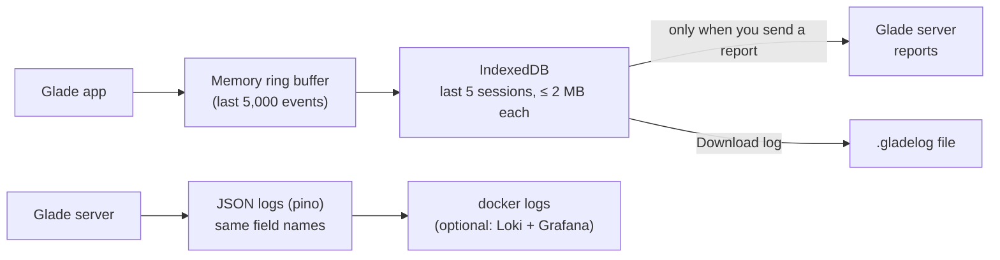

# Logging and bug reports

> **In short:** Glade logs **what happened**, step by step, but never **what you made**. Each log line follows the OpenTelemetry log format. Logs stay in your browser unless you send a bug report. From a log file, you can read the exact order of events with no guessing.

## Goals

| Goal                            | How                                                                                                                      |
| ------------------------------- | ------------------------------------------------------------------------------------------------------------------------ |
| Exact order of events           | Every action has an id. Every step logs start, result and time. Clocks are monotonic.                                    |
| No personal or creative content | A registry allows only safe fields. Everything else is dropped.                                                          |
| A known standard                | OpenTelemetry Logs Data Model fields and severity numbers. Privacy by design and data minimisation (GDPR Art. 5 and 25). |
| Works from day 1                | The logging package is built in Phase 0, before features.                                                                |

## What is logged and what is never logged

| ✅ Logged (structure)                                    | ❌ Never logged (content)                                                                  |
| -------------------------------------------------------- | ------------------------------------------------------------------------------------------ |
| Tool, mode and setting changes                           | Map names, pack names, item names                                                          |
| Op names (`move`, `raise`) and counts                    | Item types (`chair`, `fountain`) — only kind (`item`, `plant`) and source (`base`, `pack`) |
| Sizes ("6 × 4 cells"), cell counts                       | Coordinates and positions                                                                  |
| Rule ids that fired (`T3`) and counts                    | Notes, descriptions, any typed text                                                        |
| Results: committed / rejected / unchanged                | Colours, models, recipes                                                                   |
| Timings per step                                         | Share ids and edit keys                                                                    |
| Errors: code, step, stack trace                          | IP address, user agent string (only browser family and major version)                      |
| Device class: screen size bucket, touch yes/no, GPU tier | Screenshots (unless you add one to a report)                                               |

## The event registry

Every event is declared once, with exactly the fields it may carry. Anything not declared is dropped (and counted).

```ts
// packages/logging/src/events/planner.ts
export const plannerEvents = defineEvents({
  "planner.action.committed": {
    severity: "INFO",
    fields: {
      intent: z.enum(INTENT_NAMES), // "MoveSelection"
      ops: z.record(z.string(), z.number()), // { move: 3 }
      cells: z.number().int(), // how many cells touched
      mode: z.enum(MODE_IDS),
      ms: z.number(), // time in the check step
    },
  },
  "planner.action.rejected": {
    severity: "INFO",
    fields: { intent: z.enum(INTENT_NAMES), rules: z.array(z.string()), mode: z.enum(MODE_IDS) },
  },
});
```

In development, an unknown field **fails loudly**, so mistakes are caught before release.

## What a log line looks like

```json
{
  "ts": "2026-10-03T14:02:11.482Z",
  "mono": 18233.4,
  "sev": 9,
  "sevText": "INFO",
  "event": "planner.action.rejected",
  "session": "s_8Kq2",
  "trace": "a_00f3",
  "span": "check",
  "attrs": { "intent": "MoveSelection", "rules": ["I3"], "mode": "furniture" }
}
```

| Field            | OpenTelemetry name              | Meaning                              |
| ---------------- | ------------------------------- | ------------------------------------ |
| `ts`             | Timestamp                       | UTC time                             |
| `mono`           | —                               | ms since session start (never jumps) |
| `sev`, `sevText` | SeverityNumber, SeverityText    | 1–24 scale; INFO = 9                 |
| `event`          | EventName                       | From the registry                    |
| `session`        | Resource attribute `session.id` | Random per tab session               |
| `trace`          | TraceId                         | The action id                        |
| `span`           | SpanId                          | The pipeline step                    |
| `attrs`          | Attributes                      | Only registry fields                 |

## Where logs go



Logs survive a crash because they are written to IndexedDB every 2 seconds and on page hide.

## The `.gladelog` file

- One JSON object per line (NDJSON).
- Line 1 is a header: file format, Glade version and git commit, session id, start time, device class, settings (non-personal).
- Every other line is an event ([What a log line looks like](#what-a-log-line-looks-like)).

## Sending a bug report

1. Open **Report a problem** (More menu, any error pill, or Settings).
2. Write what happened (optional, but helps).
3. Glade shows **exactly what will be sent**, in plain words, with a "View raw log" button.
4. Optional, off by default, with a clear warning that they contain your work:
   - ☐ Attach my map (lets the developer replay your session exactly)
   - ☐ Attach a screenshot
5. Click **Send**. You get a report id like `R-7F3K`.
6. If the server is down: **Download report** instead, and send the file any way you like.

## Reading a log (developer side)

```text
$ pnpm glade-log show R-7F3K
session s_8Kq2 · Glade 0.6.0 (a1b2c3d) · desktop, touch: no, gpu: mid
 time      action  step       event                          details
 00:12.104 a_00f1  interpret  tool.changed                   pick → lasso
 00:14.882 a_00f2  plan       planner.action.planned         Select, mode cliffs, 214 cells
 00:18.233 a_00f3  check      planner.action.rejected        MoveSelection · rules I3
 00:18.240 a_00f3  present    ui.pill.shown                  I3
 00:21.011 a_00f4  check      worker.error  GLD-WORKER-001   timeout 5000 ms
 00:21.020 a_00f4  present    worker.restarted               mirror reloaded
```

Other commands: `glade-log filter --event worker.*`, `glade-log timeline --action a_00f3`, `glade-log stats`.

## Exact replay (only with consent)

- While you work, Glade keeps a **replay journal** in your browser: the map at session start and every op with full detail.
- It is deleted when the session ends (or after 24 hours). It never leaves the browser.
- Only if you tick **Attach my map** is it added to the report.
- Then `pnpm glade-log replay R-7F3K` runs the same ops through the editor and the profile's rules, headless, and checks each result matches the log. A mismatch points to the exact step. The log header has the Glade commit, since a rule change can change a result, so the replay runs on the same code.
