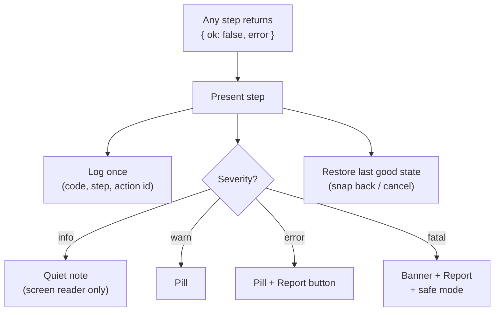

# Error handling

> **In short:** Errors are values, not surprises. Every error has a **code** (like `GLD-CHECK-002`), a plain message for the user, and a next step. Each error is handled **once**, in a known place, and logged there. One broken part of the screen never takes down the rest.

## Rules

1. **Errors are values.** Functions return `Result<T, GladeError>`. Only truly unexpected bugs throw, and those are caught at the edges ([Safety nets (the edges)](#safety-nets-the-edges)).
2. **Every error has a code.** Codes live in one registry file. `docs/error-codes.md` is generated from it.
3. **Handled once.** The step that handles an error logs it. Nobody logs and re-throws.
4. **Never silent.** No empty `catch`. ESLint blocks it.
5. **User first.** Every user-visible error says what happened, whether work is safe, and what to do.
6. **Work is safe.** No error path can lose a committed change (autosave runs after every commit).

## The error shape

```ts
// packages/errors/src/errors.ts
export interface GladeError {
  code: ErrorCode; // "GLD-CHECK-002"
  step: PipelineStep | "ui" | "storage" | "network" | "server";
  severity: "info" | "warn" | "error" | "fatal";
  userText: TextKey; // key into plain-language messages
  detail?: Record<string, string | number | boolean>; // non-personal facts only
  cause?: unknown; // original error, for logs (stack only)
}
```

**Code format:** `GLD-<AREA>-<NUMBER>`. Areas: `INT` (interpret), `PLAN`, `CHECK`, `PRES` (present), `WORKER`, `STAGE`, `STORE` (storage), `NET`, `API`, `FILE`, `BUILD` (builder), `UI`.

## Kinds of errors

| Kind                       | Example                            | Caught in       | User sees                                                                                           | Recovery                                                                               |
| -------------------------- | ---------------------------------- | --------------- | --------------------------------------------------------------------------------------------------- | -------------------------------------------------------------------------------------- |
| Rule violation (expected)  | Items overlap                      | Check step      | Violation pill                                                                                      | Thing snaps back or glows red                                                          |
| Bad op input (a Glade bug) | A Glade op gets input it can't use | Check step      | Pill: "Something went wrong. Your map is safe." + Report                                            | Action cancelled, draft thrown away, auto-logged as error                              |
| Plan error                 | Mode has no plan for this intent   | Plan step       | Pill with the same safe message                                                                     | Action cancelled                                                                       |
| Worker crash or timeout    | Out of memory                      | Worker bridge   | Pill: "Restarted the editor. Undo history was reset."                                               | New worker loads the mirror ([The editor worker](../edit/README.md#the-editor-worker)) |
| 3D context lost            | GPU reset, tab in background       | Stage host      | Banner: "3D view paused." + Retry                                                                   | Switch to 2D, try 3D again                                                             |
| Storage unavailable        | Private window, disk full          | Storage adapter | Banner: "Can't save in this browser. Download your map to keep it." + Download                      | Keep working in memory                                                                 |
| Offline / server down      | Network error                      | API client      | Badge "⟳ Changes waiting"                                                                           | Retry with back-off: 2 s, 4 s, 8 s … up to 5 min                                       |
| Version conflict           | Someone saved first                | API client      | Conflict dialog ([Editing a map someone shared](../server/sharing.md#editing-a-map-someone-shared)) | User picks                                                                             |
| Bad file                   | Not JSON, wrong game, too new      | File loader     | Dialog: plain reason + "Show details"                                                               | Nothing loads; current map untouched                                                   |
| Old file                   | Older format                       | File loader     | Note: "Updated from an older version"                                                               | Migrations run ([Format versions](../server/formats.md#format-versions))               |
| Missing pack items         | Pack not loaded                    | Catalog         | Banner: "3 items need pack 'Garden Set'" + Find                                                     | Grey stubs drawn                                                                       |
| UI crash                   | A React render error               | Error boundary  | That region shows "This part stopped working" + Reload part + Report                                | Other regions keep working                                                             |
| Unknown error              | Anything else                      | Global handler  | Pill: "Something went wrong. Your map is safe."                                                     | Logged as `fatal` with stack                                                           |

## The error path



## Safety nets (the edges)

| Net                                                                                  | Catches                                                            |
| ------------------------------------------------------------------------------------ | ------------------------------------------------------------------ |
| Error boundary per region: side panel, viewport, toolbox, builder, library, settings | React render errors in that region only                            |
| `window.onerror`, `unhandledrejection`                                               | Anything that escapes                                              |
| Worker `error` event + 5 s reply timeout                                             | Worker crashes and hangs                                           |
| `webglcontextlost`                                                                   | GPU problems                                                       |
| Server: Fastify error handler                                                        | Any route error → Problem Details response, logged with request id |
| Server: process `uncaughtException`                                                  | Logs `fatal`, exits, Docker restarts it                            |

**Safe mode:** after 2 fatal errors in one minute, Glade reloads in 2D only, with no packs, and offers to download the map. This avoids crash loops.
