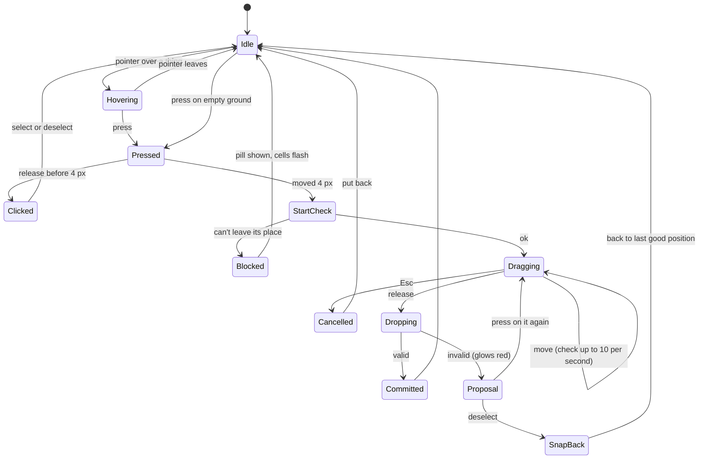

# How the planner behaves

> **In short:** Pick what to work on (the mode). Choose Hand or Pick. Select things with a select tool or by clicking. Drag to move. Bad moves glow red and snap back. Every action is one undo step.

## Camera and cursor controls

### Desktop

| Input                    | Does                                                                            |
| ------------------------ | ------------------------------------------------------------------------------- |
| Hand tool + left drag    | 3D: orbit around the centre of the view. 2D: pan.                               |
| `W` `A` `S` `D`          | Move the camera forward, left, back, right (slides, does not spin).             |
| Arrow keys               | Same as WASD, unless the keyboard cursor is on ([Full key map](#full-key-map)). |
| `Q` / `E`                | Turn the camera left / right.                                                   |
| Scroll wheel             | Zoom. (Settings can switch the wheel to pan.)                                   |
| Trackpad pinch           | Zoom.                                                                           |
| Trackpad two-finger move | Pan.                                                                            |
| Middle mouse drag        | Pan, with any tool.                                                             |
| Hold `Shift`             | Swap Hand ↔ Pick while held.                                                    |
| Right click              | Open the actions menu for the selection, the picked item, or the hovered item.  |

### Touch (phones and tablets)

| Gesture                          | Does                                                            |
| -------------------------------- | --------------------------------------------------------------- |
| Hand tool + one finger drag      | Orbit around the centre (3D) or pan (2D).                       |
| Two finger drag                  | Pan, with any tool.                                             |
| Pinch / spread                   | Zoom, with any tool.                                            |
| Two finger twist                 | Turn the camera.                                                |
| Pick or select tool + one finger | Use the tool (pick, drag, draw a selection).                    |
| Long press (500 ms)              | Open the actions menu. A small ring fills up to show the press. |
| Tap an icon                      | Show its name and flyout (replaces hover).                      |
| Two finger tap                   | Undo (optional, off by default).                                |

## Selecting

### The basics

1. A select tool makes or changes the **selection**.
2. **Set** replaces it. **Add** joins it. **Subtract** cuts from it.
3. Holding `Ctrl`/`⌘` adds for one stroke. Holding `Alt`/`⌥` subtracts for one stroke.
4. The selection is shown with a blue outline. With the ruler on, its size shows on the edges ("6 × 4 tiles").
5. Click inside the selection (without dragging) to clear it.
6. Drag inside the selection to move it ([Moving things](#moving-things)).

### What each tool picks, per mode

| Mode          | Lasso / Rectangle / Circle                                                                                                                             | Magic (click)                                                                                           |
| ------------- | ------------------------------------------------------------------------------------------------------------------------------------------------------ | ------------------------------------------------------------------------------------------------------- |
| **Furniture** | Every house, furniture piece and plant whose footprint touches the shape.                                                                              | All connected items of the same kind (e.g. a whole fence line), or a group of touching items.           |
| **Paths**     | Every tile in the shape where a path can go (on the map, not beach, not landmark). Empty tiles count, so you can fill them later.                      | All connected path tiles of the same type. On empty ground: the connected flat area where paths can go. |
| **Cliffs**    | Flat ground: every block inside. With cliffs: only blocks that have a **cliff face** inside the shape, not the ground below. Things on top come along. | Everything that shares a cliff face, plus whatever stands on it (other cliffs, items, water).           |
| **Water**     | Every water block inside, including the edge block that makes a waterfall.                                                                             | The whole connected water body.                                                                         |

**"Select ground too":** in Cliffs mode, after picking cliffs, this action adds the ground blocks inside the shape.

**Things on terrain come along:** a terrain selection always includes the plants, furniture, houses and paths standing on it.

### Switching modes keeps the selection

The selection is stored as an **area** (a set of half-tile cells), not as a list of things.

Example:

1. In Cliffs mode, you lasso a mountain.
2. You switch to Paths mode.
3. The same area stays selected, but now it means "the path tiles in this area".
4. Even if there are no paths there, the selection stays. You can use Fill to fill it.
5. Moving an empty selection shows a pill: "Nothing to move here in Paths mode".

## Moving things

### Step by step (mouse)

1. Press on a selected thing (or any thing, with the Pick tool).
2. Move more than 4 px (8 px on touch). This starts a drag. Less than that counts as a click.
3. **Start check:** Glade checks if the thing can leave its place at all.
   - If not (for example, it is locked by a landmark rule): the cells that cause the problem flash red, a pill explains why, and nothing moves.
4. While dragging, a copy follows the cursor, snapped to the mode's grid.
5. Glade checks the new spot in the background, up to 10 times a second.
   - Valid: normal look.
   - Invalid: red outline and a ⚠ icon above it.
6. Let go.
   - Valid: the move commits. One undo step.
   - Invalid: the thing **glows red** and stays there as a proposal. Click elsewhere (deselect) and it returns to its **last good position**. Or keep dragging to fix it.
7. `Esc` at any time cancels and puts everything back.

The cursor shows what will happen: open hand (can grab), closed hand (dragging), no-entry (can't move).

### Which layer wins

Glade orders things as **furniture → terrain → paths**. Things higher in the list can move without caring about the ones below.

| You move      | Onto furniture                                                                         | Onto raised land                                                                            | Onto paths                                                                     |
| ------------- | -------------------------------------------------------------------------------------- | ------------------------------------------------------------------------------------------- | ------------------------------------------------------------------------------ |
| **Furniture** | ❌ Not allowed (overlap)                                                               | ✅ Sits on top. Must be flat and dry.                                                       | ✅ Allowed. Plants only on paths that allow plants.                            |
| **Terrain**   | ❌ Not allowed where furniture stands (unless that furniture is part of what you move) | Stage 1–2: chunk replaces the land. Stage 3: merges ([Moldable terrain](#moldable-terrain)) | ✅ The paths under it are erased. A pill says how many. Undo brings them back. |
| **Paths**     | Allowed (paths can run under items, if rules allow)                                    | ✅ Paths go **on top** of land (must be flat and dry)                                       | Replaces the old path there                                                    |

A path can never end up **under** a terrain block.

## Moldable terrain

> **In short:** Pick up a piece of land and move it. In stage 1 it must land somewhere valid or it snaps back. In stage 2, Glade builds temporary terraces around it to make it valid. In stage 3, land can merge into other land and push dents into it.

### Stage 1: lift and drop

1. Select land in Cliffs or Water mode.
2. Drag it. Glade "lifts" the piece:
   - its heights (as steps above the ground around it),
   - its water,
   - its corner shapes,
   - everything on top (items, plants, paths).
3. The hole it leaves becomes **base level** (the most common height around the hole).
4. A see-through copy follows the cursor, snapped to blocks.
5. Drop it. It replaces the land under it. Paths under it are erased.
6. If the result breaks a rule, it glows red. Deselect to return it to its last good position.

**Example:** a long mountain. Select its tail. Drag it 6 blocks away. Now you have two mountains. Drag it only 1 block: the mountain just changes shape.

### Stage 2: temporary terrain (auto-terrace)

When a drop spot is **almost** valid, Glade builds the missing land for you.

1. While you drag, Glade works out the **smallest change** to the ground around the piece that makes it valid:
   - steps too tall (rule T3) → add terraces;
   - waterfall face too short (W2) → widen the cliff face;
   - corner shapes that can't exist (T5) → square them.
2. This temporary land shows as see-through purple with stripes.
3. Drop the piece: the temporary land becomes real, in the same undo step.
4. If even temporary land can't fix it (for example, a landmark or the beach is in the way), it glows red instead.

**How terraces are found (simple version):**

- Every block near the piece gets a lowest and highest allowed height, so that no neighbour is more than 3 levels away.
- Glade computes these limits by spreading out from the piece, one ring at a time (like ripples).
- Each block is then clamped between its limits. Blocks already inside the limits don't change.
- This is fast: one pass over a small area, well under 5 ms.

### Stage 3: merge and dent (research)

| Situation                                                                             | Result                                                                                                                   |
| ------------------------------------------------------------------------------------- | ------------------------------------------------------------------------------------------------------------------------ |
| Drag a land piece **into** another mountain                                           | **Blend:** the two join. The taller height wins in each block. The first mountain gets shorter because its tail is gone. |
| Drag a waterfall into the **curved face** of another water mountain, and keep pushing | **Carve:** the piece's shape wins. The other mountain gets a dent and reshapes around the waterfall.                     |
| Select part of a cliff face and drag it **inward**                                    | **Push face:** the face moves inward; the blocks behind it get lower.                                                    |
| Select part of a cliff face and drag it **outward**                                   | **Pull face:** the face moves out; new blocks are added at the cliff's height.                                           |

Default: Blend for land, Carve for water. A small toggle in the actions menu changes it.

**Order of priority:** the thing you are moving always wins over the land it lands on.

> Stage 3 needs research ([roadmap, Phase 9](../roadmap.md#phase-9-research-features-l-ongoing)). Stages 1 and 2 are the promise for the first full release.

## Raise and lower

1. Select an area (Cliffs mode).
2. In the actions menu, use the **Raise / lower** slider.
3. The selected shape goes up or down by whole levels.
4. Existing cliffs inside stay valid: Glade adds terraces at the edges if needed (like stage 2).
5. Blocks that can't move are skipped and shown with stripes:
   - under items that are only partly inside the selection;
   - landmark and beach blocks;
   - blocks already at the top (8) or bottom (0).
6. A pill notes skipped blocks: "12 blocks skipped: under items".
7. **Note:** if you lower a cliff and then raise it, it rises in the shape of the **selection**, not its old shape. Use Undo to get the old shape back.

**Items on raised ground:** when an item's whole footprint is inside the selection, its blocks move together, so it stays flat.

## Copy, paste, duplicate, delete

| Action    | Keys                   | Does                                                                                                 |
| --------- | ---------------------- | ---------------------------------------------------------------------------------------------------- |
| Copy      | `Ctrl/⌘ + C`           | Copies the selection or picked item, with everything in its scope.                                   |
| Cut       | `Ctrl/⌘ + X`           | Copy, then delete.                                                                                   |
| Paste     | `Ctrl/⌘ + V`           | The copy follows the cursor. Click to drop. `[` `]` rotate (items). `Esc` cancels.                   |
| Duplicate | `Ctrl/⌘ + D`           | Copy and paste next to the original.                                                                 |
| Delete    | `Delete` / `Backspace` | Furniture: removes items. Paths: clears paths. Cliffs: flattens to base level. Water: removes water. |

Copies also go to the system clipboard as JSON, so you can paste between browser tabs and between maps.

## The Pick tool as a state machine

Every tool is a state machine. This one shows the Pick tool. Every event is handled in every state, so nothing is missed.

## Full key map

All keys can be changed in **Settings → Controls**. On Mac, `Ctrl` means `⌘` and `Alt` means `⌥`.

### Tools and modes

| Key                         | Action                               |
| --------------------------- | ------------------------------------ |
| `H`                         | Hand                                 |
| `V`                         | Pick                                 |
| Hold `Shift`                | Swap Hand ↔ Pick while held          |
| `L`                         | Lasso                                |
| `M`                         | Rectangle                            |
| `O`                         | Circle                               |
| `Y`                         | Magic                                |
| Hold `Ctrl` while selecting | Add                                  |
| Hold `Alt` while selecting  | Subtract                             |
| `1` `2` `3` `4`             | Furniture, Paths, Cliffs, Water mode |
| `B`                         | Brush                                |
| `X`                         | Eraser                               |
| `G`                         | Fill                                 |
| `T`                         | Cut corners                          |
| `R`                         | Ruler on/off                         |

### Camera and view

| Key             | Action                                             |
| --------------- | -------------------------------------------------- |
| `W` `A` `S` `D` | Move camera                                        |
| Arrows          | Move camera (or the keyboard cursor when it is on) |
| `Q` / `E`       | Turn camera left / right                           |
| `+` / `-`       | Zoom in / out                                      |
| `F`             | Fit (selection, or whole map)                      |
| `Tab`           | 2D / 3D                                            |
| `P`             | Preview on/off                                     |

### Editing

| Key                              | Action                                                        |
| -------------------------------- | ------------------------------------------------------------- |
| `Ctrl + Z`                       | Undo                                                          |
| `Ctrl + Y` or `Ctrl + Shift + Z` | Redo                                                          |
| `Ctrl + C` / `X` / `V` / `D`     | Copy / cut / paste / duplicate                                |
| `Delete` / `Backspace`           | Delete                                                        |
| `[` / `]`                        | Rotate left / right (items)                                   |
| `Esc`                            | Cancel drag or paste → else close menu → else clear selection |
| `Shift + F10` or Menu key        | Actions menu                                                  |
| `/`                              | Search items                                                  |

### Getting around the screen

| Key                     | Action                                                           |
| ----------------------- | ---------------------------------------------------------------- |
| `F6`                    | Jump between regions: panel → viewport → toolbox → viewport menu |
| `Tab` / `Shift + Tab`   | Next / previous control (inside the side panel and toolbox)      |
| Arrows inside a toolbar | Move between buttons                                             |
| `F8`                    | Jump to the newest pill                                          |
| `?`                     | Show this key map                                                |

**Note on `Tab`:** inside the viewport, `Tab` switches 2D/3D . Use `F6` to leave the viewport. This is shown in the key map and in the guide.

### The keyboard cursor (for keyboard-only use)

1. It turns on when you move into the viewport with `F6`, or when you press `K`.
2. A square cursor shows on the map, on the current mode's grid.
3. Arrows move it one cell. The camera follows it at the edges.
4. `Enter` picks or selects what is under it. `Shift + arrows` grows a rectangle selection.
5. `Space` picks up the selection. Arrows move it. `Enter` drops it. `Esc` cancels.
6. It turns off when you use the mouse, or press `K` again.
7. Screen readers hear what is under it: "Tile 34, 40. Grass, level 1. Chair."

## User journeys

### J1: Place a chair (mouse)

1. Press `1` (Furniture mode).
2. In the toolbox, click the **Seating** tab.
3. Drag **Chair** onto the map. A see-through chair follows the cursor and snaps to half tiles.
4. Press `]` to turn it.
5. Let go. The chair is placed. "Undo: place chair" is now possible.

### J2: Place a chair (keyboard only)

1. `F6` until the toolbox is focused. `/` and type "chair". `Enter` on the chair card.
2. The keyboard cursor appears on the map with a see-through chair.
3. Arrows to move it. `]` to turn it.
4. `Enter` to place. `Esc` to stop placing.

### J3: Split a mountain in two

1. Press `3` (Cliffs mode). Choose **Lasso** (`L`).
2. Draw around the tail of the mountain. Its cliff blocks and the trees on it are selected.
3. Drag the selection 6 blocks to the east.
4. The hole becomes base level. The tail lands as its own mountain.
5. If a step is too steep, stage 2 adds purple temporary terraces. Let go to keep them.

### J4: Paint a path and round its corners

1. Press `2` (Paths mode). Choose **Brush** (`B`). Pick **Cobble** in the palette.
2. Open the brush settings (small ▾ on the button). Pick size 2.
3. Paint a path across the grass.
4. Choose **Cut** (`T`). Dots show on the corners that can be shaped.
5. Click a corner dot twice: square → round.

### J5: Raise a garden by one level

1. Press `3` (Cliffs mode). Rectangle (`M`). Drag over the garden.
2. The actions menu opens. Drag the **Raise / lower** slider up one notch.
3. The garden rises. Items fully inside rise with it. Terraces appear at the edges if needed.
4. A pill says "4 blocks skipped: under items" if some items were only partly inside.

## Things on tables (surfaces)

> **In short:** Some items have a top that small things can stand on: tables, stalls, counters. Drop a small thing on a table and it stays on that table. Move the table and everything on it comes along.

**What the profile says**

| Word           | Meaning                                                                   |
| -------------- | ------------------------------------------------------------------------- |
| Surface        | An item with a top grid, like a table (`surface: { w, h }` in half cells) |
| Placeable      | A small thing that can stand on a surface (`placeable: { w, h }`)         |
| Nothing stacks | An item has a surface **or** is placeable, never both                     |

**How it works in Furniture mode**

1. Drag a placeable item (a cup) over a table.
2. The table's top shows its own small grid. The cup snaps to it.
3. Drop it. The cup is stored on the table (layer `onSurfaces`, with the table's id).
4. Drag the cup off the table onto the ground: it becomes a normal item again, if it can stand on the ground.
5. Move or turn the table: things on it move and turn with it. One undo step.
6. Delete the table: things on it are deleted too. A pill says how many. Undo brings them back.

**Rules:** S1 (only placeable things, only on surfaces), S2 (fits wholly on the top), S3 (no overlap on one top). Friendly text is in [Petit Planet's rule text](../profiles/petit-planet.md#friendly-rule-text).

**Selecting:** a click picks the thing on top first. Click again (or press `Alt` + click) to pick the table under it.

## Homes (after 1.0)

Homes reuse everything in this section. Only these parts are new:

| Part                   | How it works                                                                                                                     |
| ---------------------- | -------------------------------------------------------------------------------------------------------------------------------- |
| Wall items             | Snap to half cells across and up the wall. They don't turn. They must stay clear of doors (rule H2).                             |
| Ceiling items          | Placed from below, like floor items. They turn like floor items.                                                                 |
| Wallpaper and flooring | Pick a room (click it in Decor mode), then click a swatch. One of each per room (rule H4).                                       |
| Camera                 | Walls hide while the camera is behind them (the profile's 3D view does this), so a room looks like a doll's house from any side. |
