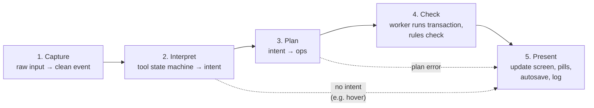
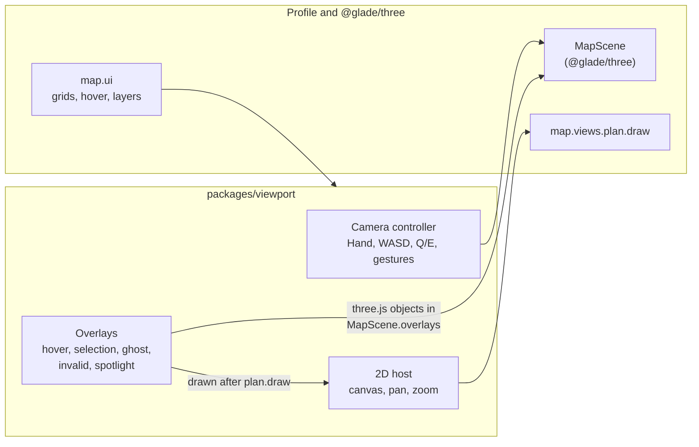
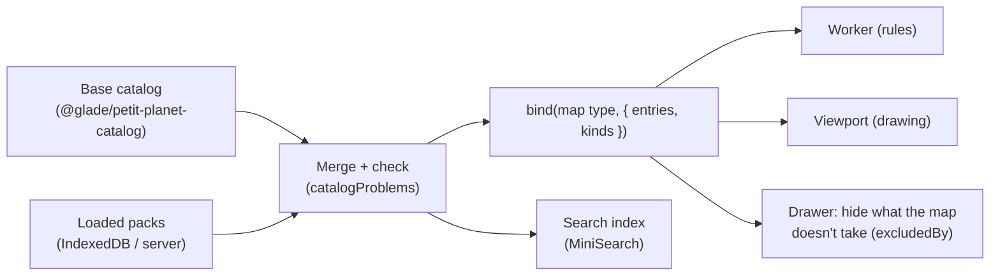

# Planner internals

> **In short:** Every user action goes through the same **5 steps**, always in order: Capture → Interpret → Plan → Check → Present. The real map lives in a background **worker**, with **the editor** ([editing](../edit/README.md)). The screen keeps a read-only copy. Nothing changes the map except a committed transaction; the profile's rules only answer "what is wrong?".

## The action pipeline



| Step         | Input                                    | Output                                                                                                              | Can fail with                | Pure?                                |
| ------------ | ---------------------------------------- | ------------------------------------------------------------------------------------------------------------------- | ---------------------------- | ------------------------------------ |
| 1. Capture   | DOM pointer, touch, key events           | `InputEvent` (world point, cell, buttons, keys, gesture)                                                            | —                            | Yes (plus reading the screen)        |
| 2. Interpret | `InputEvent` + tool state                | `Intent` or nothing                                                                                                 | `GLD-INT-*`                  | Yes                                  |
| 3. Plan      | `Intent` + mode + selection + map mirror | `Op[]` + label ("move 3 chairs")                                                                                    | `GLD-PLAN-*`                 | Yes                                  |
| 4. Check     | `Op[]`                                   | `TxResult` (committed / rejected / unchanged) + patch. The editor runs the ops; `validate` checks the changed area. | `GLD-CHECK-*`, worker errors | No (runs in the worker)              |
| 5. Present   | Result of any step                       | Store updates, stage update, pills, announcement, autosave, log                                                     | `GLD-PRES-*`                 | No (the only step with side effects) |

**Rules**

1. Steps run **in order**. No step is skipped. No step calls a later step directly.
2. Each step returns a `Result`: `{ ok: true, value }` or `{ ok: false, error }`. Steps never throw across the boundary.
3. Every run gets an **action id**. Every log line in that run carries it.
4. Only step 5 changes state or the screen.

**What it looks like in code**

```ts
// packages/planner/src/pipeline/run-action.ts
export async function runAction(input: InputEvent, deps: PipelineDeps): Promise<Outcome> {
  const run = startRun(input, deps.log); // new action id, "action.start" log

  const intent = interpret(input, deps.tools.current()); // step 2
  if (!intent.ok || intent.value === null) return present(run, intent, deps);

  const plan = planOps(intent.value, deps.context()); // step 3
  if (!plan.ok) return present(run, plan, deps);

  const checked = await deps.worker.transact(plan.value); // step 4
  return present(run, checked, deps); // step 5
}
```

## Intents and ops

Step 3 asks the game's mode planner for ops, and step 4 runs them in the editor worker. Both are
described in [editing](../edit/README.md): the intents and their ops, the worker, live checks
while dragging, and undo.

## State

| Store (Zustand slice) | Holds                                                                    | Written by                                       |
| --------------------- | ------------------------------------------------------------------------ | ------------------------------------------------ |
| `mapMirror`           | Read-only copy of the map                                                | Step 5 only, by applying patches from the worker |
| `selection`           | Selection mask + derived things per mode                                 | Step 5                                           |
| `tools`               | Active cursor tool, select tool, select mode, tool per mode, brush sizes | Step 5 (from UI and keys)                        |
| `view`                | 2D/3D, camera view mode, preview, layers, always-on flags                | Step 5                                           |
| `environment`         | Time (hour), snow                                                        | Step 5                                           |
| `history`             | Labels and selections for undo/redo                                      | Step 5                                           |
| `pills`               | Visible pills and queue                                                  | Step 5                                           |
| `catalog`             | Base items + loaded packs, search index                                  | Library actions                                  |
| `library`             | Saved maps and packs (from IndexedDB)                                    | Library actions                                  |

React components **read** stores. They never write them directly; they send events into the pipeline.

## The selection mask

- The selection is a grid of on/off bits over the **minor grid** (half tiles): 320 × 288 cells = 92,160 bits ≈ 11 KB.
- Why minor: tiles start on even minor lines, and terrain blocks start on odd ones. So the minor grid lines up with **every** Petit Planet grid.
- Set = replace bits. Add = OR. Subtract = AND NOT. All are fast.
- Each mode turns the mask into "what is selected here":
  - Furniture: items and plants whose footprint touches the mask.
  - Paths: major cells covered by the mask.
  - Cliffs / Water: terrain blocks covered by the mask, then filtered (cliff faces, water).
- The mask outline is drawn with marching squares and sent to the stage as an overlay.

## Drawing

> **In short:** The viewport (`packages/viewport`) shows the map. For 3D it mounts `MapScene` on a canvas. For 2D it calls the map's `plan.draw` on a canvas. The viewport owns the cameras, the input and the highlights; the profile only says what to draw.



| Need                     | How                                                                                                                                                                          |
| ------------------------ | ---------------------------------------------------------------------------------------------------------------------------------------------------------------------------- |
| Show a map in 3D         | `new MapScene(canvas)`, `setMap(bound)`, `setDoc(doc)`, `setLook(look, { flat, curvature })`, `setLayers(...)`                                                               |
| Time of day and snow     | `resolveLookAt(style, hour, season)` → `setLook`                                                                                                                             |
| Draw each frame          | The viewport's loop calls `scene.render(dt)` and counts frames for the FPS readout.                                                                                          |
| Cameras                  | `scene.stage`: `frame`, `switchPreset("top" \| "iso" \| "walk")`, `panBy`, `zoomAt`. The viewport turns off the stage's own orbit controls when it drives the camera itself. |
| Screen point → map point | `scene.pick(x, y)` (on the ground) or `scene.pickPlane(x, y, height)`                                                                                                        |
| Overlays in 3D           | The viewport adds three.js objects to `scene.overlays`, draped on the ground with `scene.groundAt`. They stay out of captures.                                               |
| 2D                       | The viewport's canvas, moved to world units, then `map.views.plan.draw(ctx, doc, map, layers, visible, pxPerUnit)`, then the overlays on top                                 |
| Grids and hover text     | `map.ui.grids()`, `map.ui.hover(doc, map, point)`                                                                                                                            |
| After each commit        | `scene.setDoc(newMap)`. `MapScene` rebuilds only the touched chunks (all island items are one chunk today; roadmap task T-2).                                                |
| Screenshots              | `scene.capture({ rect, camera, size, time, season }, looks)` for library cards and bug reports (`looks` tells it how to draw another time of day)                            |

- 3D code loads only when first needed (it is split into its own bundle).
- **Item thumbnails** are drawn once in `thumbs.worker.ts` and cached in IndexedDB by the item's hash. Each uses the game's item formula (`itemModel(catalog, type)`, which adds what the game adds, like a door on a house) and `modelMesh` from `@glade/render`, drawn by a tiny three.js scene on an offscreen canvas.
- The builder's **connection preview** is a second `MapScene` on a tiny map with a few fence pieces. The map formula links them.

## The catalog at runtime



- Item types are namespaced so they never clash: `glade:chair` (base), `pack:<packId>:<slug>` (packs).
- Packs may add **kinds** of their own, each under a kind the game knows (an `oak` under `tree` keeps tree spacing). `catalogProblems` checks them.
- Every merge makes **new** `entries` and `kinds` arrays, so the catalog's lookup index refreshes.
- If a map uses a type that is not loaded, the viewport draws a grey stub and rule O1 reports it. Glade shows a banner: "3 items need pack 'Garden Set'. [Find pack]".

## Performance budgets

| What                                | Budget                                                                          | How we check                          |
| ----------------------------------- | ------------------------------------------------------------------------------- | ------------------------------------- |
| Frame rate, desktop, full island 3D | 60 fps on a 2020 mid laptop                                                     | Playwright perf test with FPS counter |
| Frame rate, phone                   | 30 fps on a 2021 mid phone                                                      | Manual test each release              |
| Reply to a click                    | < 100 ms                                                                        | Pipeline timing in logs               |
| Transaction in worker               | < 10 ms on an Apple M4, with the recording draft (a full copy + diff is ~20 ms) | Benchmark test in CI                  |
| 3D update after one edit            | < 16 ms on an Apple M4 (15.6 ms today, all items in one chunk; T-2)             | Benchmark test in CI                  |
| First 3D build of the island        | < 1 s on an Apple M4, with a progress bar (0.65 s today)                        | Benchmark test in CI                  |
| First load (broadband)              | < 3 s to a usable map                                                           | Lighthouse CI                         |
| JS on first load                    | < 400 KB gzip (3D loads later)                                                  | Bundle size check in CI               |
| Autosave                            | < 20 ms, off the main thread                                                    | Benchmark test                        |
