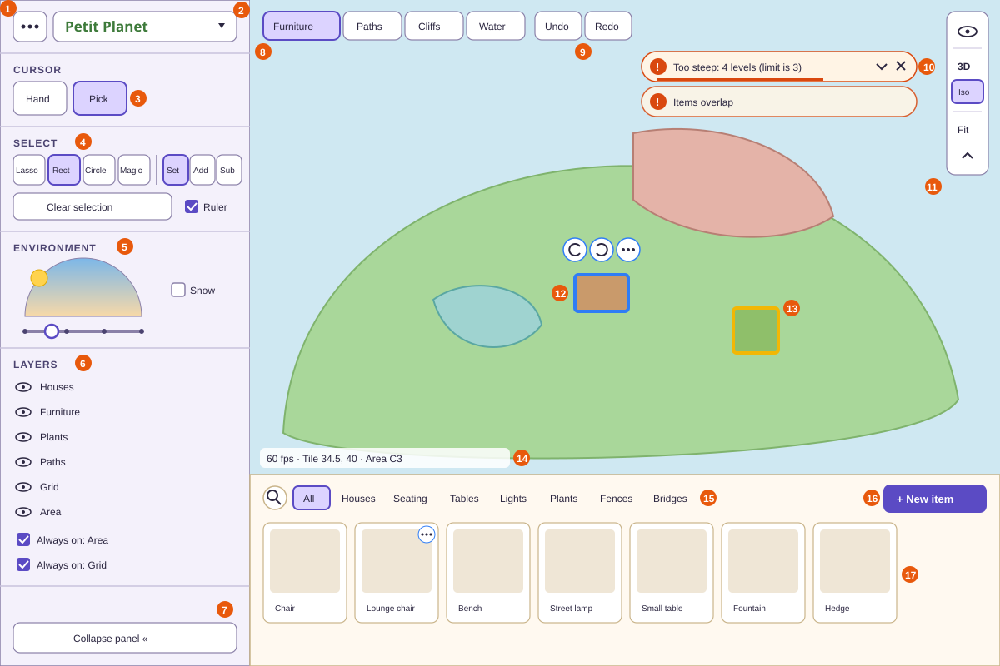
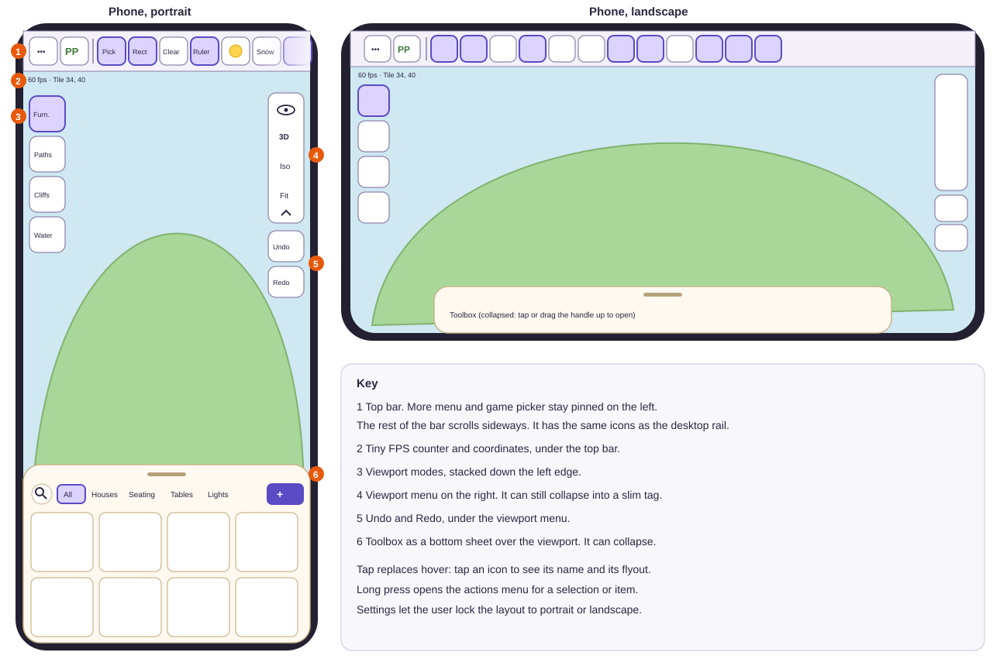
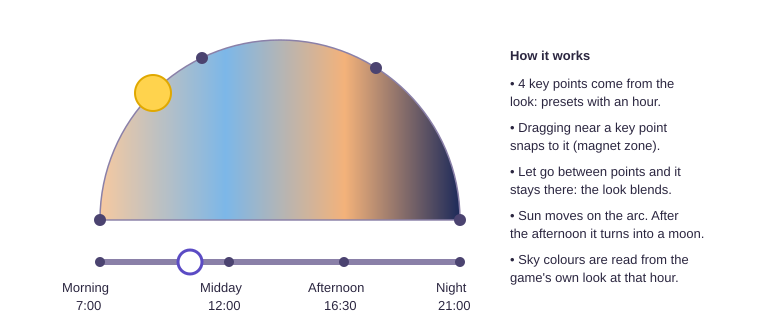
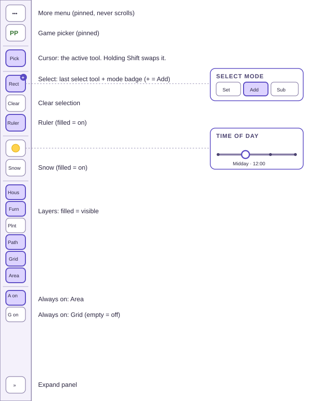
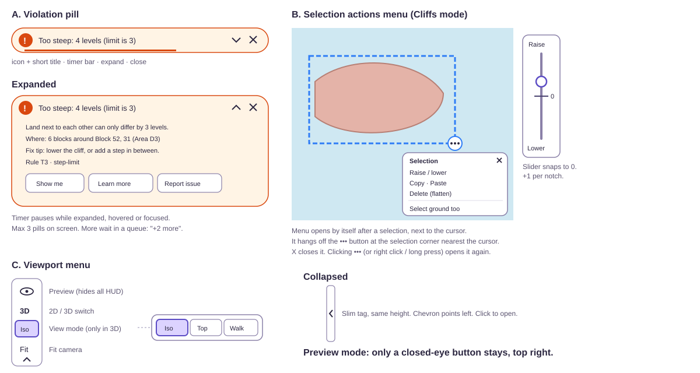

# The planner screen

> **In short:** Left: the side panel (shared by all games). Right: the viewport (the map) with the toolbox under it. The panel can shrink to a thin rail that still does everything. On phones, the panel becomes a top bar and the toolbox becomes a bottom sheet.

## Layouts

### Desktop

| #   | Part                             | Section                                                                          |
| --- | -------------------------------- | -------------------------------------------------------------------------------- |
| 1   | More menu                        | [More menu, game picker, settings, guide](#more-menu-game-picker-settings-guide) |
| 2   | Game picker                      | [More menu, game picker, settings, guide](#more-menu-game-picker-settings-guide) |
| 3   | Cursor controls                  | [Cursor](#cursor)                                                                |
| 4   | Select tools and modes           | [Select](#select)                                                                |
| 5   | Environment: time and snow       | [Environment](#environment)                                                      |
| 6   | Layers                           | [Layers](#layers)                                                                |
| 7   | Collapse panel                   | [The rail (collapsed panel)](#the-rail-collapsed-panel)                          |
| 8   | Viewport modes                   | [Viewport mode buttons (top left)](#viewport-mode-buttons-top-left)              |
| 9   | Undo and redo                    | [Undo and redo](#undo-and-redo)                                                  |
| 10  | Violation pills                  | [Violation pills](#violation-pills)                                              |
| 11  | Viewport menu                    | [Viewport menu (top right)](#viewport-menu-top-right)                            |
| 12  | Selected item with quick actions | [Highlights](#highlights)                                                        |
| 13  | Hovered item                     | [Highlights](#highlights)                                                        |
| 14  | FPS and coordinates              | [FPS and coordinates (bottom left)](#fps-and-coordinates-bottom-left)            |
| 15  | Toolbox tabs and search          | [Toolbox](#toolbox)                                                              |
| 16  | New item (opens the builder)     | [Furniture mode: the item drawer](#furniture-mode-the-item-drawer)               |
| 17  | Item cards                       | [Furniture mode: the item drawer](#furniture-mode-the-item-drawer)               |

### Screen sizes

| Screen                | How Glade decides                                       | Side panel                      | Toolbox                                          |
| --------------------- | ------------------------------------------------------- | ------------------------------- | ------------------------------------------------ |
| Desktop               | Width ≥ 1280 px                                         | Expanded (can collapse)         | Docked under the viewport, height can be dragged |
| Tablet / small laptop | Width 900–1279 px, or a large touch screen in landscape | Starts as the rail (can expand) | Docked under the viewport                        |
| Phone                 | Width < 900 px, or height < 500 px                      | Top bar, always minimised       | Bottom sheet over the viewport                   |

The user can force a layout in Settings: **Auto**, **Desktop**, **Phone portrait**, **Phone landscape**.

### Phone

## Side panel (expanded)

**Rules for the whole panel**

- Width 300 px. Everything is left aligned.
- Sections are split by thin lines.
- The header (More menu + game picker) is **pinned**. The rest scrolls if the window is short.
- Each section heading is a real heading for screen readers (`h2`).
- Each group of buttons is a **toolbar**: `Tab` enters it, arrow keys move inside it.

### Header

| Control     | Looks like                                      | Does                                                                                                           |
| ----------- | ----------------------------------------------- | -------------------------------------------------------------------------------------------------------------- |
| More menu   | `•••` button                                    | Opens the main menu ([More menu, game picker, settings, guide](#more-menu-game-picker-settings-guide)).        |
| Game picker | Game title in the game's own title font, with ▾ | Lists games. Each title is drawn in that game's font. Picking one saves the map and opens that game's planner. |

### Cursor

| Control        | Does                                                                                             | Key     |
| -------------- | ------------------------------------------------------------------------------------------------ | ------- |
| **Hand**       | Camera control. Left-drag orbits the camera around the centre of the view (3D) or pans (2D).     | `H`     |
| **Pick**       | Click picks the thing in the cell (based on the viewport mode). Drag a thing to move it at once. | `V`     |
| Hold **Shift** | Swaps to the other tool while held. Let go to go back.                                           | `Shift` |

The active tool is always highlighted. While Shift is held, the swapped tool shows highlighted with a small "held" dot.

### Select

One row: 4 tools on the left, 3 modes on the right.

| Control                           | Does                                             | Key               |
| --------------------------------- | ------------------------------------------------ | ----------------- |
| **Lasso**                         | Draw any shape. Selects what is inside.          | `L`               |
| **Rectangle**                     | Drag a box.                                      | `M`               |
| **Circle**                        | Drag a circle from its centre.                   | `O`               |
| **Magic**                         | Click to select everything connected (flood).    | `Y`               |
| **Set**                           | New selection replaces the old one.              | —                 |
| **Add**                           | New selection joins the old one.                 | hold `Ctrl` / `⌘` |
| **Subtract**                      | New selection is removed from the old one.       | hold `Alt` / `⌥`  |
| **Clear selection** (wide button) | Clears the selection.                            | `Esc`             |
| **Ruler** (tick box)              | Shows sizes on the selection and while dragging. | `R`               |

What each tool selects depends on the viewport mode ([Selecting](behaviour.md#selecting)).

### Environment

| Control                        | Does                                                                                                                                                                           |
| ------------------------------ | ------------------------------------------------------------------------------------------------------------------------------------------------------------------------------ |
| **Time slider**                | Sets the time of day. Snaps to 4 key points (from the game's look): Morning 7:00, Midday 12:00, Afternoon 16:30, Night 21:00. You can also stop between them; the look blends. |
| **Sun arc** (above the slider) | A half circle. The sun moves along it as you slide. The sky colours come from the game's look at that hour. After the afternoon, the sun becomes a moon.                       |
| **Snow** (tick box)            | Turns on winter (season `winter`).                                                                                                                                             |

A map type with a fixed look (one preset, no seasons, like a home) hides this whole section, in the panel and the rail.

**Slider details**

- Range: 7:00 to 21:00.
- Magnet zone: within 0.75 hours of a key point, it snaps there.
- Keyboard: `←` `→` move 15 minutes. `Page Up` / `Page Down` jump to the next key point. `Home` / `End` go to the ends.
- Screen readers hear: "Time of day, Afternoon, 4:30 PM".

### Layers

| Row             | Shows / hides                          | Profile layer toggle         |
| --------------- | -------------------------------------- | ---------------------------- |
| Houses          | Items of kind `building`               | `items` (needs T-1 to split) |
| Furniture       | All other items, bridges, inclines     | `items`                      |
| Plants          | Trees, bushes, flowers, crops          | `plants`                     |
| Paths           | Paths                                  | `paths`                      |
| Grid            | Cell lines for the current mode's grid | host grid lines              |
| Area            | Area lines and labels (16 × 16 tiles)  | host area grid               |
| Always on: Area | Tick box                               | —                            |
| Always on: Grid | Tick box                               | —                            |

Each row has an eye button. Clicking the row name also toggles it.

**How "Always on" works**

| Always on: Grid | Grid row                             | What you see                                                                                                                         |
| --------------- | ------------------------------------ | ------------------------------------------------------------------------------------------------------------------------------------ |
| ✅ Ticked       | Enabled. Its eye works.              | Eye open: grid everywhere. Eye closed: no grid.                                                                                      |
| ⬜ Not ticked   | Disabled (greyed). Tooltip says why. | **Grid spotlight**: the grid shows only under the hovered, picked or dragged thing, about 3 tiles around it, fading out at the edge. |

| Always on: Area | Area row                | What you see                                                                |
| --------------- | ----------------------- | --------------------------------------------------------------------------- |
| ✅ Ticked       | Enabled. Its eye works. | Eye open: all area lines and labels. Eye closed: none.                      |
| ⬜ Not ticked   | Disabled (greyed).      | Only the **active area** shows: the area under the cursor or the selection. |

## The rail (collapsed panel)

The rail is 64 px wide. **Everything in the panel still works from the rail.**

| Rail item   | Shows                                                                      | Hover / focus / tap                   |
| ----------- | -------------------------------------------------------------------------- | ------------------------------------- |
| More        | `•••`                                                                      | Opens the More menu.                  |
| Game        | Game's small logo                                                          | Opens the game picker.                |
| Cursor      | The active tool (Hand or Pick). Changes while Shift is held.               | Click swaps tools. Flyout shows both. |
| Select tool | The last select tool used, with a small badge for the mode (`=`, `+`, `−`) | Flyout shows the 4 tools and 3 modes. |
| Clear       | Deselect icon                                                              | Clears the selection.                 |
| Ruler       | Ruler icon, filled when on                                                 | Toggles the ruler.                    |
| Time        | One of 4 icons: sunrise, sun, sunset, moon                                 | Flyout shows just the slider.         |
| Snow        | Snowflake, filled when on                                                  | Toggles snow.                         |
| Layers      | One icon per layer, filled when visible                                    | Click toggles.                        |
| Always on   | Area icon and grid icon, filled when on                                    | Click toggles.                        |
| Expand      | `»`                                                                        | Opens the full panel.                 |

Flyouts open on hover after 300 ms, or at once on click, tap or keyboard focus. `Esc` closes them.

## Phone top bar

- Height 52 px. Same items as the rail, in a row.
- **More** and **Game** stay pinned on the left. The rest scrolls sideways. A soft fade on the right edge shows there is more.
- Tap replaces hover: tap an icon to see its name and its flyout. Tap again to use it.
- Flyouts drop down under the bar.

## Viewport

The viewport shows the map in 2D or 3D. It fills all space right of the panel and above the toolbox. On phones it fills the screen under the top bar.

### Viewport mode buttons (top left)

| Mode          | Grid used                            | Scope (what tools touch)                     | Other things                                                  |
| ------------- | ------------------------------------ | -------------------------------------------- | ------------------------------------------------------------- |
| **Furniture** | Base: half-tile snapping, tile lines | Houses, furniture, plants, bridges, inclines | —                                                             |
| **Paths**     | Base: tiles                          | Paths only                                   | Items and plants turn see-through, so you can see under them. |
| **Cliffs**    | Terrain: blocks                      | Land (heights) and what stands on it         | —                                                             |
| **Water**     | Terrain: blocks                      | Water and what stands on it                  | —                                                             |

Keys: `1` Furniture, `2` Paths, `3` Cliffs, `4` Water.
On phones the buttons stack down the left edge.

**Home modes (after 1.0).** A home has its own modes. Same keys, same places.

| Mode        | Key | Grid used                       | Scope (what tools touch)                                                                 |
| ----------- | --- | ------------------------------- | ---------------------------------------------------------------------------------------- |
| **Floor**   | `1` | Half tiles on the floor         | Floor items, and things on their tables                                                  |
| **Walls**   | `2` | Half cells across and up a wall | Wall items. The camera turns to face the wall you work on.                               |
| **Ceiling** | `3` | Half tiles on the ceiling       | Ceiling items. The view is from below.                                                   |
| **Decor**   | `4` | Rooms                           | Wallpaper and flooring for each room. The toolbox shows swatches, like the path palette. |

### Undo and redo

- Desktop: next to the mode buttons.
- Phone: on the right, under the viewport menu.
- Disabled (greyed) when there is nothing to undo or redo. The tooltip says what will be undone: "Undo: move 3 chairs".

### Viewport menu (top right)

| Row                 | Does                                                                                                                                  | Key   |
| ------------------- | ------------------------------------------------------------------------------------------------------------------------------------- | ----- |
| 👁 Preview           | Hides all panels and controls. The map fills the screen. Only a closed-eye button stays, top right. Click it (or `Esc`) to come back. | `P`   |
| 2D / 3D             | Switches view. Hidden when the map type has only one view.                                                                            | `Tab` |
| View mode (3D only) | Iso, Top or Walk. Click to see the 3 options.                                                                                         | —     |
| Fit                 | Moves the camera to the default view for 2D or 3D. With a selection, fits the selection.                                              | `F`   |
| Collapse            | The menu folds into a slim tag of the same height, with a left-pointing chevron.                                                      | —     |

### FPS and coordinates (bottom left)

Example: `60 fps · Tile 34.5, 40 · Area C3`

| Mode          | Coordinates shown                         |
| ------------- | ----------------------------------------- |
| Furniture     | Tile, in half steps: `Tile 34.5, 40`      |
| Paths         | Tile: `Tile 34, 40`                       |
| Cliffs, Water | Block and level: `Block 34, 40 · Level 3` |

The coordinates follow the selected cell. With no selection, they follow the cursor. FPS can be hidden in Settings. On phones this is tiny text, top left, under the top bar.

### Highlights

| State                                                                 | Look                                                | Not colour alone                |
| --------------------------------------------------------------------- | --------------------------------------------------- | ------------------------------- |
| Hover                                                                 | Yellow outline (`#F2B705`)                          | Outline gets thicker            |
| Selected                                                              | Blue outline and soft glow (`#2F7DF6`)              | Dashed edge for area selections |
| Invalid (while moving)                                                | Red outline (`#E03131`) + ⚠ yellow alert icon above | Icon + diagonal stripes         |
| Cells causing a violation                                             | Flash red 3 times                                   | Flashing outline                |
| Temporary terrain ([Moldable terrain](behaviour.md#moldable-terrain)) | See-through purple with stripes                     | Stripes                         |
| Just changed                                                          | Short soft flash                                    | —                               |

Settings has 2 extra colour sets for colour blindness (deuteranopia, tritanopia).

**Quick actions on a picked item:** a small floating row above it: ⟲ rotate left, ⟳ rotate right, `•••` actions menu.

## Violation pills

| Part           | Detail                                                                                                                                                            |
| -------------- | ----------------------------------------------------------------------------------------------------------------------------------------------------------------- |
| Where          | Slide in from the top centre of the viewport.                                                                                                                     |
| Shape          | A long pill: icon, short title, timer bar, expand chevron, close X.                                                                                               |
| How many       | Up to 3 on screen. More wait in a queue, shown as "+2 more".                                                                                                      |
| Repeats        | The same rule again merges into one pill with a count: "Items overlap (×3)".                                                                                      |
| Timer          | 6 seconds by default (2 to 30 in Settings, or "until closed"). Pauses on hover, focus or when expanded.                                                           |
| Ends           | Fades down and out. `X` closes early.                                                                                                                             |
| Expanded       | Plain explanation · where it is · a fix tip · the rule id · buttons: **Show me** (camera goes there, cells flash), **Learn more** (guide page), **Report issue**. |
| Screen readers | Read out politely when they appear ("Too steep, 4 levels, limit is 3").                                                                                           |
| Keyboard       | `F8` jumps to the newest pill. `Esc` closes it.                                                                                                                   |

Pill text comes from the game's `ruleText` table, in its `ui` package ([Petit Planet's](../profiles/petit-planet.md#friendly-rule-text)).

## Actions menu (the "more" menu on a selection)

**When it opens:** right after a selection is made, next to the cursor. It hangs off a small `•••` button at the corner of the selection nearest the cursor. `X` closes it. Click `•••`, right-click, long-press, or `Shift + F10` to open it again. Settings can turn off auto-open.

| Mode                       | Options                                                                                                                                |
| -------------------------- | -------------------------------------------------------------------------------------------------------------------------------------- |
| Furniture (picked item)    | Rotate left · Rotate right · Create new from this (opens builder) · Search similar · Copy · Paste · Duplicate · Add note · Delete      |
| Furniture (area selection) | Copy · Paste · Duplicate · Delete · Select only… (houses / furniture / plants)                                                         |
| Paths                      | Fill with… (palette) · Clear paths · Round corners · Cut corners · Copy · Paste · Delete                                               |
| Cliffs                     | **Raise / lower** (first) · Copy · Paste · Delete (flatten to base level) · **Select ground too** (last, only when cliffs were picked) |
| Water                      | Raise water level · Remove water · Copy · Paste · Delete                                                                               |
| Empty selection            | Paste · Fill (Paths) · Raise (Cliffs) · Add water (Water)                                                                              |

**Raise / lower control:** a vertical slider. 0 in the middle, and it snaps back to 0. Up raises, down lowers, 1 level per notch. The map preview updates as you slide. Letting go commits it as one undo step.

## Toolbox

Desktop: under the viewport. Its height can be dragged (min 140 px, max half the window).
Phone: a bottom sheet over the viewport. Drag its handle to open or close it.

The toolbox **changes with the viewport mode**. It remembers the last tool, path type and item for each mode.

### Furniture mode: the item drawer

| Part           | Detail                                                                                                                                                                                     |
| -------------- | ------------------------------------------------------------------------------------------------------------------------------------------------------------------------------------------ |
| Search icon    | Left of the tabs. Click (or `/`) and it grows into a search bar about 60% of the toolbox width.                                                                                            |
| Tabs           | All · Houses · then the game's categories · then one tab per pack you have ("My packs").                                                                                                   |
| **+ New item** | Big button on the right. Opens a blank builder.                                                                                                                                            |
| Cards          | Thumbnail, name, small pack badge if it is from a pack. Footprint shown on hover ("1 × 2 tiles").                                                                                          |
| Drag a card    | Drag it into the viewport. A see-through copy follows the cursor and snaps to the grid. It turns red if it can't go there. `[` and `]` rotate while dragging.                              |
| Click a card   | Highlights it and shows `•••` at its top right. Then click on the map to place it (repeat to place more). `Esc` stops placing.                                                             |
| Card `•••`     | **Create new** (open in builder as a copy) · **Search similar**.                                                                                                                           |
| Search         | Matches name, description, id, kind, category and tags, ignoring tabs. Typo-tolerant.                                                                                                      |
| Search similar | Puts the item's kind or category into the bar as a chip, like `kind: fence`, and searches. A kind chip also finds sub-kinds: `kind: plant` finds trees, shrubs and flowers.                |
| What shows     | Only items the open map type takes. The island hides wall and ceiling items, wallpaper and flooring. Glade asks the profile (`excludedBy`), so no item needs an "indoor" or "outdoor" tag. |

### Paths mode

A row of tools on top, a palette of path types below.

| Tool       | Does                                                                                                                                                       | Settings (small ▾ on the button, or long press on phone) | Key |
| ---------- | ---------------------------------------------------------------------------------------------------------------------------------------------------------- | -------------------------------------------------------- | --- |
| **Brush**  | Paint the chosen path.                                                                                                                                     | Size 1, 2, 3 or 5 tiles · square or round                | `B` |
| **Eraser** | Remove paths.                                                                                                                                              | Size, shape                                              | `X` |
| **Fill**   | With a selection: click a palette swatch to fill it. No selection: click the map to fill the connected empty area.                                         | —                                                        | `G` |
| **Cut**    | Click a path corner to cycle: square → round → cut. Only outer corners. Single tiles can't be cut (a game rule). Allowed corners show small dots on hover. | —                                                        | `T` |

The palette shows each path type as a swatch with its pattern (cobble or plain) and name.

### Cliffs and Water modes

Same tools, no Fill, no drawer.

| Tool   | Cliffs                                                                         | Water                                    |
| ------ | ------------------------------------------------------------------------------ | ---------------------------------------- |
| Brush  | Raise land to a target level (or +1 per stroke). Settings: size, target level. | Add water on top blocks. Settings: size. |
| Eraser | Lower land to the base level.                                                  | Remove water.                            |
| Cut    | Shape cliff corners: square, round or cut (half a block).                      | Shape water corners.                     |

## More menu, game picker, settings, guide

### More menu

| Item                  | Does                                                                                                                                                                                                                 |
| --------------------- | -------------------------------------------------------------------------------------------------------------------------------------------------------------------------------------------------------------------- |
| Home                  | Goes to `/`. In the first version this opens a simple game list (see Q-1).                                                                                                                                           |
| New map               | Starts a fresh map. The current one is already autosaved. When the game has more than one map type, a small dialog asks which: "Island" or a home layout ("Home, 1 room, 8 × 8"). In 1.0 only the island is offered. |
| Open map…             | Opens the Library on the Maps tab.                                                                                                                                                                                   |
| Save                  | Saves a named save point. If the map is shared with edit rights, also uploads it. Shows "Saved ✓".                                                                                                                   |
| Save as…              | Saves a copy with a new name.                                                                                                                                                                                        |
| Share…                | Makes view and edit links ([sharing](../server/sharing.md)).                                                                                                                                                         |
| Import / Export file… | Load or download a `.glade-map.json` file.                                                                                                                                                                           |
| Catalog packs…        | Opens the Library on the Packs tab.                                                                                                                                                                                  |
| Settings              | Opens Settings.                                                                                                                                                                                                      |
| Guide                 | Opens the Guide.                                                                                                                                                                                                     |
| Report a problem      | Opens the bug report form ([bug reports](../logging/README.md#sending-a-bug-report)).                                                                                                                                |

All items are for the current game only.

### Settings window (tabs)

| Tab              | Options                                                                                                                                                       |
| ---------------- | ------------------------------------------------------------------------------------------------------------------------------------------------------------- |
| General          | Theme (light, dark, game default) · Layout (Auto, Desktop, Phone portrait, Phone landscape) · Language (English for now)                                      |
| Accessibility    | Text size · Dyslexia-friendly font (Atkinson Hyperlegible / OpenDyslexic) · High contrast · Reduce motion · Highlight colours · Pill duration · Tooltip delay |
| Controls         | Key map editor · Mouse and touch speed · Invert zoom · Drag dead zone                                                                                         |
| Planner          | Auto-open actions menu · Show FPS · Show coordinates · Autosave on/off (on by default)                                                                        |
| Graphics         | Quality: low / medium / high · Shadows · Planet curvature                                                                                                     |
| Privacy and logs | What gets logged (shown in plain words) · Detailed logs on/off · View log · Download log · Delete all local data                                              |
| About            | Glade version, licences                                                                                                                                       |

### Guide

- Pages written in plain words with pictures. One page per tool and per rule.
- Pills, tooltips and Settings link straight to the right page.
- Searchable.
- A first-time tutorial overlay is planned for later ([roadmap, Later](../roadmap.md#later)).

## Game theme

Each game's theme (colours, fonts, shapes, icons) comes from its `ui` package as design tokens. See
[UI principles and themes](../ui/README.md#game-theme).
