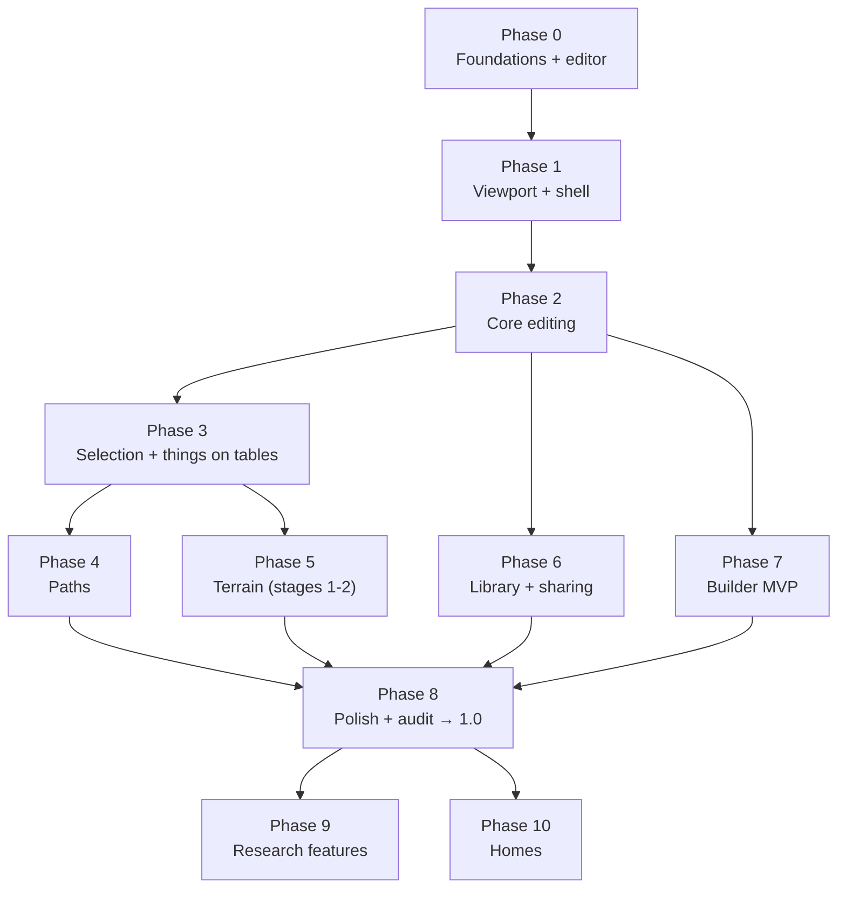

# Roadmap

> **In short:** 11 phases. Foundations and logging come first, then the shell, then editing,
> selection, paths, terrain, sharing, the builder, polish, and finally the research features.
> Phases 0–6 give a usable, shareable planner. Phases 7–8 add the builder and make it 1.0. Homes
> come after 1.0, in Phase 10. The game profiles already exist, so most phases build on them.

Sizes: **S** = about 1 week, **M** = 2–3 weeks, **L** = 4–6 weeks (one person, part-time guesses).

## Done

- The repo, the pnpm workspace, TypeScript, ESLint, Prettier, the boundary and references tests,
  and CI (lint, typecheck, tests).
- The shared profile packages: `@glade/core`, `@glade/render`, `@glade/three`, `@glade/testkit`.
- Petit Planet's profile: the island and two home layouts, every rule with a test, the look, and
  render goldens.

## Phase 0: Foundations (M)

| Deliverables                                                                                                          |
| --------------------------------------------------------------------------------------------------------------------- |
| `packages/errors`: `Result`, the error shape, the error registry                                                      |
| `packages/logging`: event registry, logger, IndexedDB sink, `.gladelog` writer, redaction tests                       |
| `packages/ui`: design tokens, Button, IconButton, Toggle, Toolbar, Tooltip, Menu, Slider, Dialog in Storybook         |
| `packages/edit`: draft, patch, transaction, history, with the recording draft ([editing](edit/README.md)). Game-free. |
| CI jobs that apply so far ([CI](engineering/ci-and-deploy.md))                                                        |
| Docker image (hello page + `/health`), compose file, deploy and rollback workflows                                    |
| Fixtures: a real-size island map and catalog                                                                          |
| ESLint import rules for the catalog, edit and ui packages, as they are added                                          |

**Exit:** CI green. A deploy works. A **rollback drill** works. Storybook builds. Editor tests
pass, including "op then undo = start".

## Phase 1: Viewport and the shell (M)

| Deliverables                                                                                                                      |
| --------------------------------------------------------------------------------------------------------------------------------- |
| `packages/viewport`: 2D host (canvas + `plan.draw`), 3D host (`MapScene`), render loop, FPS counter, look from time and season    |
| Shell layout: side panel, rail, phone top bar, viewport chrome, toolbox frame, viewport menu, preview, FPS/coords                 |
| Routing `/<game>/planner`, the game registry, game picker, theming                                                                |
| The `_fixture` game's UI (both its maps) and Petit Planet's `ui` package with the island's UI (theme, modes, layers, environment) |
| Hand tool, WASD, Q/E, zoom, touch gestures; time slider + sun arc; snow; layers                                                   |
| Settings window (skeleton), More menu (skeleton)                                                                                  |

**Exit:** a real-size island opens in 2D and 3D on desktop and a real phone. The fixture's 2D-only
map opens with no 3D switch. Every panel control works by keyboard. No axe errors. FPS and first 3D
build time measured on target devices (decides T-4).

## Phase 2: Core editing (L)

| Deliverables                                                                           |
| -------------------------------------------------------------------------------------- |
| Editor worker, worker bridge, mirror (new map object per patch), crash recovery        |
| The pipeline ([planner internals](planner/internals.md)) with log events for each step |
| Shared object ops in `packages/edit` (place, move, rotate, remove) used by the island  |
| Profile tasks T-1 (houses and furniture layers) and T-2 (split the items chunk)        |
| Pick tool, hover/select highlights, drag move with live checks, rotate, delete         |
| Item drawer: tabs, cards, thumbnails, search, click-to-place, keyboard place           |
| `@glade/petit-planet-catalog`: base items with categories, bound with `bind`           |
| Violation pills + rule text for every rule                                             |
| Undo/redo, autosave, New/Open/Save locally                                             |

**Exit:** journeys J1 and J2 pass in e2e. Transaction < 10 ms on an Apple M4. Worker crash
recovery tested.

## Phase 3: Selection, and things on tables (M)

| Deliverables                                                                                                                    |
| ------------------------------------------------------------------------------------------------------------------------------- |
| Rect, circle, lasso, magic; set/add/subtract; selection mask; mode switching keeps it                                           |
| Selection and spotlight overlays in the viewport; screen-to-ground with `MapScene.pick`                                         |
| Actions menu (all modes), copy/cut/paste/duplicate, ruler                                                                       |
| Keyboard cursor                                                                                                                 |
| Things on tables: drop on a table, move with the table, rules S1–S3 text; a few base tables and small things. Profile task T-3. |

**Exit:** property tests for set maths pass. Keyboard-only selection e2e passes. A cup dropped on a
table moves with the table.

## Phase 4: Paths (S–M)

Brush, eraser, fill, cut; palette; brush settings; see-through items in Paths mode. **Exit:** J4
passes.

## Phase 5: Terrain, stages 1 and 2 (L)

| Deliverables                                                                                                                                                                                                                                                                                                   |
| -------------------------------------------------------------------------------------------------------------------------------------------------------------------------------------------------------------------------------------------------------------------------------------------------------------- |
| Cliffs and Water tools (brush, eraser, cut)                                                                                                                                                                                                                                                                    |
| Raise/lower slider with terraces and skipped-block display                                                                                                                                                                                                                                                     |
| Lift and drop (stage 1), last-good-position snap back                                                                                                                                                                                                                                                          |
| Shared terrain ops in `packages/edit/terrain` with the `full` support style: `transplant`, terraces for raise/lower, `settle`; Petit Planet's waterfall handling in its `edit` package; temporary terrain overlay (stage 2). Built on the profile's `setTerrain`, `isEditableTerrain`, `edgeRun`, `fallSides`. |
| Layer precedence rules ([moving things](planner/behaviour.md#moving-things))                                                                                                                                                                                                                                   |

**Exit:** J3 and J5 pass. Property test: after `settle`, rule T3 always holds in the settled area.
Stage 2 behind flag `terrain.stage2` until approved.

## Phase 6: Library and sharing (L)

| Deliverables                                                                 |
| ---------------------------------------------------------------------------- |
| Library window, file import/export, export library                           |
| Server: API, SQLite, blobs, upload checks, limits, metrics                   |
| Share dialog, links, edit sync, conflict dialog, view-only mode, make a copy |
| Pack publishing and loading                                                  |
| Bug reports + `glade-log` CLI (show, filter, timeline, replay)               |

**Exit:** share → open on another device → edit → conflict path all pass e2e. A report round trip
works.

**Milestone: Planner 1.0 beta** (Phases 0–6).

## Phase 7: Builder MVP (L)

| Deliverables                                                                                                |
| ----------------------------------------------------------------------------------------------------------- |
| `packages/builder`: part tree, surfaces, layout rules, compile to a model, recipe format                    |
| Builder window + standalone route                                                                           |
| Templates: Other, Fence/hedge, Path tile, Lamp, Table, Small thing                                          |
| Parts: slab (with 90°/60° bends), disc, cantilever and pillar legs, dome toppings with forms, simple shapes |
| Paint, problems panel, file menu, save dialog, open from planner, connection preview                        |

**Exit:** both worked examples ([builder](builder/README.md)) pass as e2e tests. Every compiled
recipe passes `entryProblems` (property test).

## Phase 8: Polish and audit (M) → 1.0

Real phone testing, manual VoiceOver and NVDA pass, guide content, performance pass, release
checklist, first public release.

## Phase 9: Research features (L, ongoing)

Terrain stage 3 (merge, dent, push/pull faces), curved toppings (mesh), more builder templates
(house, bridge, incline, tree), patterns on model parts (T-5).

## Phase 10: Homes (L)

| Deliverables                                                                                  |
| --------------------------------------------------------------------------------------------- |
| Home UI: Floor, Walls, Ceiling, Decor modes, layers, rule text, screen reader text            |
| Home ops: floor, wall and ceiling items, coverings, things on tables (shared with the island) |
| New map dialog with map types; library cards show the map type                                |
| Base catalog: wall items, ceiling items, wallpaper, flooring                                  |
| Builder templates: Wall item, Ceiling item, Wallpaper, Flooring                               |

**Exit:** make a home, hang a picture, lay a floor, set a cup on a table, share it, open it on
another device.

## Later

Home page · first-time tutorial overlay · live co-editing · Palworld · Stardew Valley ·
translations · library code sync · custom home layouts (Q-24) · link a house on the island to its
home (Q-25) · item states, like an open window (`itemModel`) · more terrain support styles, when a
game needs them.

## Profile and engine tasks

Changes to the shared profile packages and Petit Planet's profile that the phases above need.
Each keeps the profile rules: shared packages stay game-free, rules stay customizable, every change
has tests.

| Id  | Change                                                                                                        | Why                                                                                        | Size | Phase          |
| --- | ------------------------------------------------------------------------------------------------------------- | ------------------------------------------------------------------------------------------ | ---- | -------------- |
| T-1 | **Split the island's `items` layer toggle** into buildings and other items (2D and 3D).                       | Separate Houses and Furniture layers.                                                      | S    | 2              |
| T-2 | **Split the island's items chunk** by area, so changing one item rebuilds only the items near it.             | Today any item change rebuilds all 914 items and plants in 3D (15.6 ms on an Apple M4).    | S–M  | 2              |
| T-3 | **A writer for things on tables** (`putOnSurface`), and `surfaceOf` in the public API.                        | Every other layer has a typed writer; this one has only a reader.                          | S    | 3              |
| T-4 | **Build 3D chunks off the main thread** (let `MapScene` take chunks built in a worker).                       | The first 3D build of the island takes 0.65 s on an Apple M4. Only if phones are too slow. | M    | 1–2, if needed |
| T-5 | **Patterns on model parts.**                                                                                  | Builder patterns. Patterns exist for wallpaper, flooring and paths, which is a start.      | M    | Later          |
| T-6 | **A `support` param** in profiles with terrain (Petit Planet: `full`), read by the terrain ops and the rules. | One place for how terrain may overhang ([editing](edit/README.md#support-styles)).         | S    | 5              |

### Measured speed

Apple M4, Node, a real-size island (375 items, 539 plants, 0 violations, 147 KB file):

| Task                                           | Time    | Meaning                                                                |
| ---------------------------------------------- | ------- | ---------------------------------------------------------------------- |
| Load the map file                              | 5.1 ms  | 🟢 Instant.                                                            |
| Check the whole map                            | 8.7 ms  | 🟢 Fine on load.                                                       |
| Check only the area around one item (`region`) | 3.4 ms  | 🟢 Good for live drag checks.                                          |
| Copy the whole map                             | 6.4 ms  | 🟡 Avoid on every change: the editor records changes instead.          |
| Save to text                                   | 2.3 ms  | 🟢 Autosave is cheap.                                                  |
| Move one item with a full copy and diff        | ~20 ms  | 🟡 Too slow for every frame; the recording draft aims for under 5 ms.  |
| 3D: rebuild after moving one item              | 15.6 ms | 🟡 All items sit in one chunk (T-2).                                   |
| 3D: build the whole island the first time      | 0.65 s  | 🟡 Once, on load. Phones may be 3–5 times slower; show a progress bar. |

## Risks

| #   | Risk                                                                | Chance | Impact | What we do                                                                            |
| --- | ------------------------------------------------------------------- | ------ | ------ | ------------------------------------------------------------------------------------- |
| R1  | Moldable terrain (stage 3) is harder than hoped                     | High   | Medium | Ship stages 1–2 first. Stage 3 is research behind a flag.                             |
| R2  | 3D is slow on phones                                                | Medium | High   | Measure in Phase 1. Quality settings. Worker. 2D default on weak devices.             |
| R3  | Making enough base items takes long                                 | Medium | Medium | Start small, with the kinds every map needs. Community packs.                         |
| R4  | Legal: fonts, names, look-alike items                               | Low    | High   | Open fonts only. Original models. No game assets. "Fan project, not affiliated" note. |
| R5  | Abuse of anonymous sharing                                          | Medium | Medium | Limits, abuse reports, unpublish tool, no HTML in content.                            |
| R6  | The server goes down                                                | Medium | Low    | Local-first. Backups. Clear "sharing offline" message.                                |
| R7  | Scope creep                                                         | High   | Medium | Phases with exit criteria. "Later" list.                                              |
| R8  | A 3D canvas is hard for screen reader users                         | Medium | Medium | Keyboard cursor, text descriptions, testing with real users.                          |
| R9  | A log leaks content by mistake                                      | Low    | High   | Registry with allowed fields only, redaction tests, review of every new event.        |
| R10 | The builder doesn't feel "smart"                                    | Medium | Medium | Prototype layout rules in Storybook early; test with users before Phase 7.            |
| R11 | Editing is a lot of code to keep right                              | Medium | High   | Small game-free core with property tests: any op, then undo, gives back the start.    |
| R12 | Shared code bends to fit one game                                   | Medium | Medium | Build for the games that exist; move code up only when a second game needs it.        |
| R13 | 3D is slow to update after edits on big islands (all items rebuild) | Medium | Medium | T-2. Until then, wait for the drag to end before calling `setDoc`.                    |

## Open questions

Each has a proposed answer.

| #    | Question                                                                                                   | Proposed answer                                                                                                                   |
| ---- | ---------------------------------------------------------------------------------------------------------- | --------------------------------------------------------------------------------------------------------------------------------- |
| Q-1  | What does **Home** do before the homepage exists?                                                          | A simple page listing games.                                                                                                      |
| Q-2  | Which domain?                                                                                              | One domain. All URLs in these docs are placeholders.                                                                              |
| Q-3  | Does Furniture mode include plants, houses and bridges?                                                    | Yes: it covers everything from the catalog drawer.                                                                                |
| Q-4  | Are the key choices OK: Shift = swap tools, Ctrl = add, Alt = subtract, `[` `]` = rotate, `1`–`4` = modes? | Yes, and all keys can be changed.                                                                                                 |
| Q-5  | Petit Planet item categories?                                                                              | Start with: Houses, Seating, Tables, Storage, Lights, Decor, Plants, Trees, Fences, Bridges and inclines, Outdoor.                |
| Q-6  | Live co-editing (two people at once)?                                                                      | Not in 1.0. Version checks and a conflict dialog instead.                                                                         |
| Q-7  | Optional **library code** to sync a library across devices?                                                | Yes, as a stretch goal in Phase 6.                                                                                                |
| Q-8  | How long are shared maps kept?                                                                             | Forever for now. Review when the data folder passes 10 GB.                                                                        |
| Q-9  | Title font for Petit Planet?                                                                               | An open (OFL) rounded font such as Fredoka or Baloo 2.                                                                            |
| Q-10 | Licence for the base catalog data?                                                                         | CC BY 4.0 (the code is MIT).                                                                                                      |
| Q-11 | Where do bug reports go?                                                                                   | Stored on the server. A maintainer reviews them with `glade-log`, then one command opens a GitHub issue. Nothing posts by itself. |
| Q-12 | Must a map follow all rules to be shared?                                                                  | No. Works in progress can be shared.                                                                                              |
| Q-13 | Fences: fixed 1 × 1 footprint with a 0.5–1 tile body. OK?                                                  | Yes (linking pieces must be exactly one tile).                                                                                    |
| Q-14 | Patterns in the builder for 1.0?                                                                           | No. Colours and finishes first.                                                                                                   |
| Q-15 | What does "Raise water level" do?                                                                          | Raises the water body and its banks by one level, when valid.                                                                     |
| Q-16 | Any usage analytics?                                                                                       | None. Only bug reports (opt-in) and server metrics.                                                                               |
| Q-17 | Is 200 undo steps enough?                                                                                  | Yes.                                                                                                                              |
| Q-18 | Keep local save points (version history) per map?                                                          | Yes, the last 20 saves.                                                                                                           |
| Q-19 | Show the time slider range only from 7:00 to 21:00?                                                        | Yes, it matches Petit Planet's 4 presets.                                                                                         |
| Q-20 | Default drag check rate (10 per second) and pill time (6 s)?                                               | Yes. Both can be changed in Settings.                                                                                             |
| Q-21 | Homes (inside houses) in 1.0?                                                                              | No. The shell supports many map types from Phase 1 (cheap), but the Home planner is Phase 10, after 1.0.                          |
| Q-22 | Things on tables in 1.0?                                                                                   | Yes, on the island, in Phase 3. It is small, and the base catalog will have tables.                                               |
| Q-23 | Wallpaper and flooring with the user's own pictures?                                                       | Not at first: colours and shapes only. Pictures mean storing images, size limits and checking content.                            |
| Q-24 | Let users design their own home layouts (rooms, doors)?                                                    | Not at first. Only the game's layouts. The profile can make a map for any layout, so this is possible later.                      |
| Q-25 | Link a house on the island to its home design?                                                             | Later. Maps don't link to each other, so Glade would keep the link in its own map file.                                           |
| Q-26 | Are the words OK: **map type** (island, home) and **map** (one design you make)?                           | Yes. The UI never says "map type"; it says "Island" or "Home".                                                                    |
