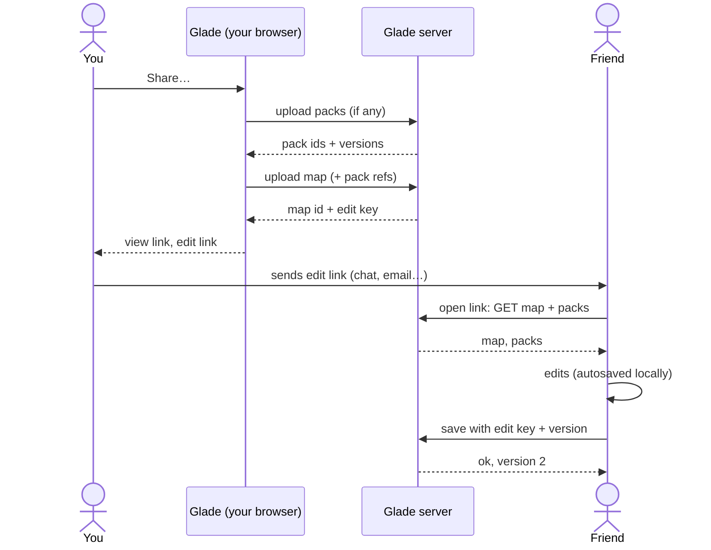

# Saving, library and sharing

> **In short:** Your maps and packs live in your browser's **Library**. To share, Glade uploads a copy and gives you two links: a **view link** and an **edit link**. Anyone with the edit link can change the map. Packs used by a map travel with it. No sign-up, ever.

## The Library

One window, opened from **More → Open map…** or **More → Catalog packs…**.

| Part         | Detail                                                                                                  |
| ------------ | ------------------------------------------------------------------------------------------------------- |
| Tabs         | **Maps** · **Packs**                                                                                    |
| Filter       | All · Mine · Shared with me                                                                             |
| Search       | By name                                                                                                 |
| Sort         | Last opened (default) · Name · Last changed                                                             |
| Card         | Thumbnail (a 3D snapshot), name, game, last changed, badges                                             |
| Card actions | Open · Rename · Duplicate · Share… · Export file · Delete (or Remove from my library, for others' maps) |

| Badge             | Meaning                                                   |
| ----------------- | --------------------------------------------------------- |
| 💾 Local          | Only in this browser. Not shared.                         |
| 🔗 Shared         | You shared it. You hold the edit key.                     |
| ✏️ Can edit       | Someone shared it with you, with edit rights.             |
| 👁 View only       | Someone shared it with you, view only.                    |
| ⟳ Changes waiting | Your edits are not uploaded yet (offline or server down). |
| ⬆ Newer version   | Someone else saved a newer version.                       |

## Share a map, step by step

1. **More → Share…**
2. The dialog lists what will be shared: the map, and any of **your packs** it uses ("This map uses 2 of your packs. They will be shared too.").
3. Click **Create links**.
4. Glade uploads the map and the packs.
5. You get two links with copy buttons (and a QR code):
   - **View link:** `https://glade.app/petit-planet/planner/m/7Hq2xV9pLk3mRt8wZ4bN1`
   - **Edit link:** the same link plus `#edit=<secret key>`
6. The map's badge changes to 🔗 Shared.

**Why the key is after `#`:** browsers never send the part after `#` to the server, so the key never appears in server or proxy logs. The app sends it in a request header only when saving.

## Editing a map someone shared

1. Open the edit link. The map opens and is added to **Shared with me** (with its key).
2. Edits save in your browser at once, as always.
3. Every 10 seconds of quiet, and on **Save**, Glade uploads them.
4. Each upload says which version it started from. If the server has a newer version, a dialog asks:
   - **Keep both:** your version becomes a copy.
   - **Use theirs:** load the newer version (your changes are kept as a local copy, just in case).
   - **Use mine:** replace theirs (they can still get theirs back from version history).
5. Live co-editing (two people at once, seeing each other) is **not** in the first version (Q-6).

**View-only links:** the map opens read-only. Editing tools are greyed. A banner offers **Make a copy** to edit your own version.

## Packs

| Rule                                                                     | Why                                       |
| ------------------------------------------------------------------------ | ----------------------------------------- |
| A pack has an id, a name, a game and a **version**.                      | So maps can say exactly what they need.   |
| Published versions never change. Saving makes a new version.             | Old maps keep working.                    |
| A map stores which pack versions it uses.                                | Opening a map loads exactly those.        |
| When a newer pack version exists, the map shows "Pack update available". | You choose when to update.                |
| Opening a shared map adds its packs to **Shared with me**.               | You can use those items in your own maps. |
| Packs can be shared on their own, with the same view/edit links.         | Share an item set without a map.          |

## Moving to another device

Without accounts, the library lives in one browser. Two ways to move it:

1. **Export library** (Settings → Privacy): downloads one file with all maps, packs and keys. Import it on the other device.
2. **Library code** (optional, see Q-7): a secret code that stores your library list on the server. Enter it on another device to get the same list.

## What the server knows

| Stored                                       | Not stored                          |
| -------------------------------------------- | ----------------------------------- |
| Shared maps and packs (only those you share) | Names, emails, accounts             |
| Hashed edit keys                             | Edit keys themselves                |
| When things were created and changed         | IP addresses (not kept in app logs) |
| Bug reports you choose to send               | Anything you didn't share           |
